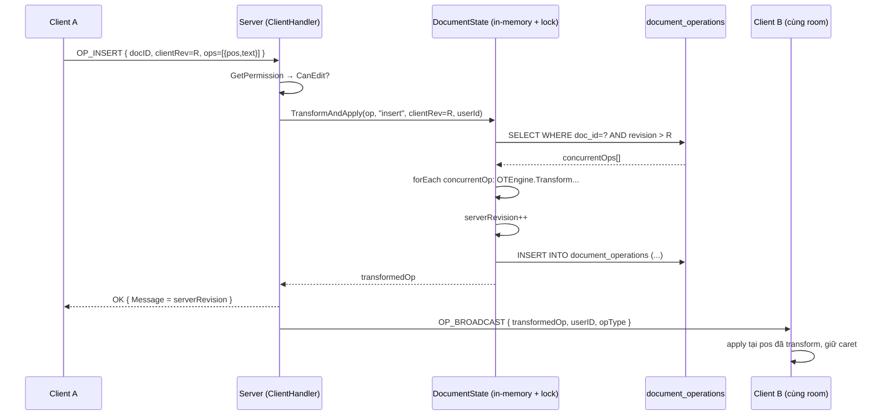
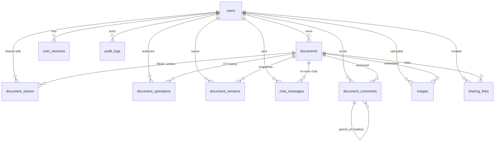
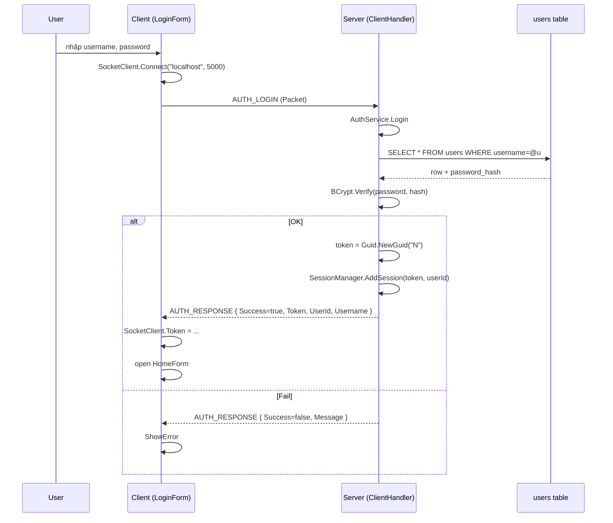

# MarkTogether — Tài liệu kỹ thuật toàn diện

> **Đồ án môn NT106 — Lập trình mạng căn bản**  
> Trường Đại học Công nghệ Thông tin — ĐHQG-HCM  
> Ứng dụng soạn thảo Markdown cộng tác thời gian thực theo mô hình Client–Server.

---

## Mục lục

1. [Tổng quan dự án](#1-tổng-quan-dự-án)
2. [Kiến trúc hệ thống](#2-kiến-trúc-hệ-thống)
3. [Cấu trúc thư mục](#3-cấu-trúc-thư-mục)
4. [Công nghệ sử dụng](#4-công-nghệ-sử-dụng)
5. [Hướng dẫn cài đặt môi trường](#5-hướng-dẫn-cài-đặt-môi-trường)
6. [Hướng dẫn chạy dự án](#6-hướng-dẫn-chạy-dự-án)
7. [Hướng dẫn test từng chức năng](#7-hướng-dẫn-test-từng-chức-năng)
8. [Cơ sở dữ liệu](#8-cơ-sở-dữ-liệu)
9. [Tài liệu giao thức (API/Packet Reference)](#9-tài-liệu-giao-thức-apipacket-reference)
10. [Realtime / Socket flow](#10-realtime--socket-flow)
11. [Authentication & Security](#11-authentication--security)
12. [UI Flow](#12-ui-flow)
13. [Những file quan trọng nhất](#13-những-file-quan-trọng-nhất)
14. [Các lỗi thường gặp khi chạy](#14-các-lỗi-thường-gặp-khi-chạy)
15. [Kịch bản demo end-to-end](#15-kịch-bản-demo-end-to-end)
16. [Tổng kết](#16-tổng-kết)
17. [Phụ lục: Threading, packet format, OT chi tiết](#17-phụ-lục-threading-packet-format-ot-chi-tiết)

---

## 1. Tổng quan dự án

### 1.1. Tên & mục tiêu

- **Tên:** MarkTogether
- **Mục tiêu:** Xây dựng từ nền tảng (without framework) một ứng dụng soạn thảo Markdown **cộng tác thời gian thực** giống Google Docs, sử dụng **TCP Socket** và **giao thức nhị phân tự định nghĩa**.
- **Vấn đề giải quyết:**
  - Nhiều người cùng chỉnh sửa một tài liệu Markdown cùng lúc, mọi thay đổi đồng bộ tức thì giữa các client.
  - Tránh xung đột bằng thuật toán **Operational Transformation (OT)** thay vì khoá tài liệu.
  - Quản lý phân quyền (owner / editor / commenter / viewer) theo mô hình RBAC.
  - Lịch sử phiên bản, bình luận theo đoạn, chat trong tài liệu, AI gợi ý, upload ảnh.

### 1.2. Các thành phần chính

```
┌──────────────────────────────┐
│        MarkTogether          │
├──────────────────────────────┤
│  Client (WinForms, .NET 4.7) │   ← UI người dùng + WebView2 preview
│  Server (Console, .NET 4.7)  │   ← TCP Socket Server, OT engine, RBAC
│  Shared (DLL)                │   ← Packet, MessageType, PacketHelper
│  PostgreSQL 13+              │   ← Lưu user, document, ops, version,
│                              │     comment, chat, image, sharing link
└──────────────────────────────┘
```

| Thành phần | Vai trò |
|------------|---------|
| **Client (WinForms)** | Giao diện soạn thảo Markdown chia đôi: editor + preview (WebView2). Quản lý kết nối TCP, gửi op, nhận broadcast. |
| **Server (Console / Mono service)** | TCP listener, dispatch packet theo `MessageType`, transform OT, persist DB, broadcast. |
| **Shared** | Định nghĩa `Packet`, `MessageType`, mọi `Payload_*` và `PacketHelper` (length-prefix protocol). |
| **PostgreSQL** | Lưu trữ persistent: users, documents, document_operations, document_versions, document_shares, sharing_links, chat_messages, document_comments, images, audit_logs, schema_migrations. |
| **WebView2 (Edge)** | Render Markdown sang HTML phía client (Markdig pipeline + highlight.js). |
| **Gemini API (tuỳ chọn)** | AI gợi ý: chat, summarize, continue, translate. |

### 1.3. Các chức năng chính (đã implement)

1. **Auth** — đăng ký, đăng nhập, đăng xuất (BCrypt hash, GUID token).
2. **Document management** — tạo, mở, lưu (manual + autosave), xoá mềm, import `.md`, search.
3. **Sharing** — share theo username, share-code, sharing link với expiry/maxUses, public/private/restricted visibility.
4. **Realtime collaboration (OT)** — `OP_INSERT` / `OP_DELETE` được transform server-side và broadcast.
5. **Markdown rendering** — Markdig + WebView2 với debounce 280 ms.
6. **Chat trong document** — `CHAT_SEND` / `CHAT_BROADCAST` / `CHAT_HISTORY`.
7. **Comment có anchor** — gắn comment vào range ký tự, resolve/delete, broadcast realtime.
8. **Version history** — auto snapshot mỗi lần save, list/detail/restore/delete.
9. **Image upload** — dedup theo SHA-256, lưu file system + metadata DB, có quota.
10. **AI suggestion** — gọi Gemini với model do user chọn, API key lưu phía client bằng DPAPI, throttle 1 req/3 s/user.
11. **Audit logs + persistent sessions** — schema sẵn sàng (`audit_logs`, `user_sessions`).

---

## 2. Kiến trúc hệ thống

### 2.1. Sơ đồ tổng thể

```mermaid
flowchart LR
    subgraph Client["MarkTogether.Client (WinForms)"]
        LF[LoginForm / RegisterForm]
        HF[HomeForm]
        TR[TypeRenderForm]
        SC[SocketClient (singleton)]
        WV[WebView2 Preview]
        TR --> WV
        LF --> SC
        HF --> SC
        TR --> SC
    end

    subgraph Net["TCP Socket — port 5000"]
        PROTO[/4-byte length prefix + JSON Packet/]
    end

    subgraph Server["MarkTogether.Server (Console / Mono service)"]
        SS[SocketServer (TcpListener)]
        CH[ClientHandler per connection]
        SM[SessionManager (token, room)]
        OT[OT Engine + DocumentStateManager]
        SVC[Services: Auth / Permission / Image / AI / ShareCode]
        REPO[Repositories (Dapper)]
    end

    DB[(PostgreSQL 13+<br/>marktogether_db)]
    Storage[(/var/lib/marktogether<br/>image files)]
    Gemini[(Google Gemini API)]

    SC <-->|Packet| PROTO
    PROTO <-->|Packet| CH
    SS --> CH
    CH --> SM
    CH --> OT
    CH --> SVC
    SVC --> REPO
    OT --> REPO
    REPO --> DB
    SVC --> Storage
    SVC --> Gemini
```

### 2.2. Luồng request/response cơ bản

```
┌───────────────────┐                 ┌──────────────────┐
│  Client thread    │                 │  Server handler   │
└─────────┬─────────┘                 └────────┬──────────┘
          │  build Packet:                     │
          │  { Type, Token, RequestId, JSON }  │
          ├──── 4-byte len + JSON ────────────▶│
          │                                    │  PacketHelper.Receive
          │                                    │  → switch(Type) → Handle*()
          │                                    │  → AuthService / Repo / OT
          │                                    │  → reply.RequestId = origin
          │◀── 4-byte len + JSON ──────────────┤
          │  Dispatcher match RequestId        │
          │  → TaskCompletionSource.SetResult  │
          │  → caller resume                   │
```

- **Mọi packet đều có `RequestId`** (Guid). Client lưu vào `_pending` ConcurrentDictionary, server echo lại trong reply để dispatcher demultiplex.
- **Khi `RequestId` rỗng** → packet là server-push (broadcast), client raise event tương ứng (`OnOpBroadcast`, `OnChatBroadcast`, ...).

### 2.3. Realtime collaboration (OT) flow



### 2.4. Threading model

- **Server**
  - Main thread: `Console.ReadLine()` hoặc chờ `SIGTERM`/`SIGINT`.
  - 1 task `SocketServer.StartAsync` chạy `AcceptTcpClientAsync` vòng lặp.
  - Mỗi client → 1 task chạy `ClientHandler.ProcessAsync`. Đọc tuần tự packet, xử lý, gửi reply.
  - `DocumentState.TransformAndApply` được bảo vệ bằng `lock(_lock)` để serialize OT transform per-document.
  - `SessionManager._docRooms` sử dụng `ConcurrentDictionary` + `lock(_roomsLock)` để bảo vệ HashSet bên trong.
  - AI request chạy trên `Task.Run` để không block loop chính.

- **Client**
  - UI thread: WinForms message pump.
  - 1 background thread `MarkTogether-ReceiveLoop` đọc packet, dispatch:
    - Reply → `TaskCompletionSource.SetResult` (gỡ khoá caller đang `await`).
    - Broadcast → raise event → handler dùng `BeginInvoke` để chuyển về UI thread.
  - `Request(...)` đồng bộ → bao bọc bởi `Task.Run(...)` ở các nút lệnh để không freeze UI.

---

## 3. Cấu trúc thư mục

```text
NT106_Project_MarkTogether/
├── MarkTogether.sln                     # Solution gốc
├── MarkTogether.slnx
├── README.md                             # README ngắn (đã có)
├── DOCUMENTATION.md                      # ← File này
├── docker-compose.prod.yml               # PostgreSQL container cho production
├── .gitattributes / .gitignore
│
├── deploy/                               # Triển khai production trên VPS
│   ├── env/
│   │   └── marktogether.env.example      # Mẫu /etc/marktogether/env
│   ├── scripts/
│   │   ├── backup.sh                     # Backup pg_dump
│   │   ├── deploy-release.sh             # Deploy artefact mới
│   │   └── run-migrations.sh             # Chạy migration_v2.sql
│   └── systemd/
│       └── marktogether.service          # Unit file Mono service
│
├── MarkTogether.Shared/                  # DLL dùng chung Client + Server
│   ├── Shared.csproj
│   ├── Packet.cs                         # MessageType, Packet, mọi Payload_*
│   ├── PacketHelper.cs                   # Send/Receive 4-byte length prefix
│   └── README.md
│
├── MarkTogether.Server/                  # Console server (.NET 4.7.2 / Mono)
│   ├── Server.csproj
│   ├── App.config                        # Connection string + GeminiApiKey fallback dev/demo
│   ├── Program.cs                        # Entry, Dapper config, port resolve
│   │
│   ├── Network/
│   │   ├── SocketServer.cs               # TcpListener, accept loop
│   │   ├── ClientHandler.cs              # Dispatch packet (~1700 dòng)
│   │   └── SessionManager.cs             # Token store + DocRoom
│   │
│   ├── OT/
│   │   ├── OTEngine.cs                   # 4 transform rules (II / ID / DI / DD)
│   │   ├── DocumentState.cs              # State + lock per-document
│   │   └── DocumentStateManager.cs       # ConcurrentDictionary docId → state
│   │
│   ├── Services/
│   │   ├── AuthService.cs                # Register / Login (BCrypt)
│   │   ├── DocumentPermissionService.cs  # RBAC tập trung
│   │   ├── AISuggestionService.cs        # Gemini wrapper, whitelist model + API key động
│   │   ├── ImageStorageService.cs        # Lưu ảnh dedup SHA-256
│   │   ├── ImageValidator.cs             # Magic-byte + MIME check
│   │   ├── SecureTokenGenerator.cs       # URL-safe random token
│   │   └── ShareCodeGenerator.cs         # Code 8 ký tự không trùng
│   │
│   └── Database/
│       ├── DbConnectionFactory.cs        # Npgsql connection (env > config)
│       ├── Models/                       # POCO Dapper map
│       │   ├── User.cs
│       │   ├── Document.cs
│       │   ├── DocumentOperation.cs
│       │   ├── DocumentVersion.cs
│       │   ├── DocumentShare.cs
│       │   ├── ChatMessage.cs
│       │   ├── Comment.cs
│       │   ├── Image.cs
│       │   ├── SharingLink.cs
│       │   └── ActiveSession.cs
│       ├── Repositories/                 # Dapper repositories
│       │   ├── UserRepository.cs
│       │   ├── DocumentRepository.cs
│       │   ├── DocumentShareRepository.cs
│       │   ├── DocumentVersionRepository.cs
│       │   ├── ChatRepository.cs
│       │   ├── CommentRepository.cs
│       │   ├── ImageRepository.cs
│       │   └── SharingLinkRepository.cs
│       └── Scripts/
│           ├── schema_init.sql           # Tạo schema lần đầu
│           └── migration_v2.sql          # Mở rộng (visibility, links, audit...)
│
├── MarkTogether.Client/                  # WinForms client (.NET 4.7.2)
│   ├── Client.csproj
│   ├── App.config
│   ├── Program.cs                        # Run(new LoginForm())
│   ├── server.config                     # HOST=...  PORT=5000
│   │
│   ├── Network/
│   │   ├── SocketClient.cs               # Singleton TCP, Request/Reply, push events
│   │   └── Logger.cs
│   │
│   ├── UI/
│   │   ├── AppTheme.cs                   # Color, Font, Spacing constants
│   │   └── UiFactory.cs                  # Style buttons, panels, list
│   │
│   ├── LoginForm.cs / .Designer.cs       # Đăng nhập
│   ├── RegisterForm.cs / .Designer.cs    # Đăng ký
│   ├── HomeForm.cs / .Designer.cs        # Danh sách document, join code, logout
│   ├── CreateDocumentForm.cs             # Modal nhập tiêu đề
│   ├── TypeRenderForm.cs                 # Editor + Preview + Chat + Comment + AI
│   ├── AISettingsForm.cs / .Designer.cs  # Modal cấu hình Gemini model + API key
│   ├── Services/AISettingsStore.cs       # Lưu AI settings ở %AppData%, mã hoá DPAPI
│   ├── ShareDocumentForm.cs              # UI chia sẻ + share code regen
│   ├── ShareManagementForm.cs            # Visibility + collaborators (advanced)
│   ├── VersionHistoryForm.cs             # Liệt kê + restore version
│   └── NewCommentForm.cs                 # Modal nhập nội dung comment
│
├── Plan/                                 # Tài liệu thiết kế nội bộ
│   ├── ARCHITECTURE_EXPANSION_PLAN.md
│   ├── KE_HOACH_CHI_TIET_9_CHUC_NANG.md
│   ├── PHASE6_PRODUCTION_DEPLOYMENT.md
│   ├── PHAN_CHIA_CONG_VIEC.md
│   ├── walkthrough.md                    # Nhật ký tích hợp OT
│   ├── Auth/Auth_Implementation.md
│   ├── Database/Database_Explanation.md
│   ├── Database/Database_Implementation.md
│   ├── MainPage/MainPage_Implementation_Guide.md
│   ├── Send_OP_EDIT/OP_SEND_Frequency_Algorithm.md
│   └── UI_*.md                           # Changelog UI
│
└── packages/                             # NuGet (đã restore)
```

### Ý nghĩa các thư mục quan trọng

- `MarkTogether.Shared/` — **PHẢI** giữ đồng bộ giữa client và server. Mọi field thêm vào payload phải build lại cả 2 phía.
- `MarkTogether.Server/Network/` — Toàn bộ logic mạng. `ClientHandler.cs` là nơi tập trung tất cả handler theo `MessageType`.
- `MarkTogether.Server/OT/` — Thuật toán OT, độc lập với network để dễ unit-test.
- `MarkTogether.Server/Database/Scripts/` — File SQL idempotent, chạy nhiều lần an toàn.
- `MarkTogether.Client/UI/` — Theme/style tập trung. Mọi form đều đi qua `UiFactory`.

---

## 4. Công nghệ sử dụng

| Lớp | Công nghệ | Mục đích |
|-----|-----------|----------|
| **Ngôn ngữ** | C# 7.3 (.NET Framework 4.7.2) | Compatible với WinForms + Mono trên Linux |
| **Build** | MSBuild + NuGet `packages.config` | Solution truyền thống, không SDK-style |
| **GUI** | Windows Forms | Yêu cầu môn học (mạng + WinForms) |
| **Render Markdown** | Markdig 1.1.2 + WebView2 (Edge Chromium) | Render Markdown → HTML; WebView hiển thị có syntax highlight |
| **Syntax highlight** | highlight.js 11.11 (CDN) | Tô màu code block trong preview |
| **Network** | `System.Net.Sockets.TcpListener` / `TcpClient` | TCP raw, không HTTP |
| **Giao thức** | 4-byte little-endian length prefix + UTF-8 JSON `Packet` | Framing đơn giản, đủ tin cậy |
| **Serialization** | Newtonsoft.Json 13.0.4 | Serialize/deserialize Packet + Payload (kể cả `byte[]` base64) |
| **Hash mật khẩu** | BCrypt.Net-Next 4.1.0 (workFactor=12) | Salt+stretch chống brute-force |
| **Database** | PostgreSQL 16 (Docker) hoặc 13+ (local) | Persistent storage |
| **Driver** | Npgsql 4.1.13 | ADO.NET provider |
| **ORM** | Dapper 2.1.72 | Micro-ORM, parameterized query, snake_case ↔ PascalCase |
| **Token** | `Guid.NewGuid().ToString("N")` cho session, `RandomNumberGenerator` cho sharing link | |
| **AI** | Google Gemini REST API | Chat / summarize / continue / translate; user chọn model, tự nhập API key |
| **Triển khai** | Mono 5+ (Linux), systemd unit, Docker Compose (Postgres) | Production deploy lên VPS Linux |
| **Health/Backup** | `pg_isready` healthcheck, `backup.sh` `pg_dump` | Production hardening |

---

## 5. Hướng dẫn cài đặt môi trường

### 5.1. Phía Developer (Windows)

| Hạng mục | Yêu cầu |
|----------|---------|
| OS | Windows 10/11 |
| IDE | Visual Studio 2022/2026 (workload **.NET desktop development**) |
| Framework | **.NET Framework 4.7.2 Developer Pack** |
| WebView2 | **Microsoft Edge WebView2 Runtime** (Win11 đã có sẵn) |
| Build tool | MSBuild đi kèm Visual Studio (đường dẫn trong `Plan/` dùng `MSBuild.exe`) |
| Database | PostgreSQL 13+ và pgAdmin 4 / DBeaver |
| Git | git for Windows (commit kéo về) |

#### 5.1.1. Restore NuGet

NuGet packages đã được commit kèm trong `packages/`. Nếu thiếu:

```cmd
:: Cài nuget.exe vào PATH, sau đó
nuget restore MarkTogether.sln
```

#### 5.1.2. Cấu hình PostgreSQL local

1. Cài PostgreSQL 13+ (mặc định port 5432, user `postgres`).
2. Mở pgAdmin 4 → tạo database `myapp_db`.
3. Mở Query Tool, chạy lần lượt:
   - `MarkTogether.Server/Database/Scripts/schema_init.sql`
   - `MarkTogether.Server/Database/Scripts/migration_v2.sql`
4. Cập nhật `MarkTogether.Server/App.config`:

```xml
<connectionStrings>
  <add name="MarkTogetherDb"
       connectionString="Host=localhost;Port=5432;Database=myapp_db;Username=postgres;Password=YOUR_PASSWORD"
       providerName="Npgsql" />
</connectionStrings>
```

> **Lưu ý:** Nếu biến môi trường `MARKTOGETHER_DB_CONNECTION` được set, nó **override** App.config (xem `DbConnectionFactory.cs`).

#### 5.1.3. (Tuỳ chọn) Bật AI

Từ bản hiện tại, AI **không còn yêu cầu hard-code API key trên server**. Mỗi user tự cấu hình trong client:

1. Lấy API key tại <https://aistudio.google.com/>.
2. Mở tài liệu → tab **Trợ lý AI** → bấm **⚙ Cài đặt**.
3. Chọn model Gemini, nhập API key, bấm **Test kết nối**.
4. Bấm **Lưu**.

Client lưu cấu hình tại:

```text
%AppData%\MarkTogether\ai_settings.json
```

`ApiKeyEncrypted` được mã hoá bằng Windows DPAPI `DataProtectionScope.CurrentUser`, nên file copy sang máy/user khác sẽ không decrypt được.

`MarkTogether.Server/App.config` chỉ còn là fallback dev/demo, production nên để rỗng:

```xml
<appSettings>
  <!-- Fallback API key cho dev/demo (không bắt buộc).
       Production: mỗi user tự nhập trong 'Cài đặt AI' phía client.
       Server KHÔNG hard-code key cho người dùng cuối. -->
  <add key="GeminiApiKey" value="" />
</appSettings>
```

Nếu client chưa cấu hình key và server fallback cũng rỗng, tab AI sẽ báo:
`"Bạn chưa cấu hình API key cho AI. Mở 'Cài đặt AI' bây giờ?"` và **không gửi request lên server**.

#### 5.1.4. Cấu hình Client

- File `MarkTogether.Client/server.config` chỉ định địa chỉ server:

```text
HOST=localhost
PORT=5000
```

Hiện tại `LoginForm.cs` đang **hardcode** `SocketClient.Instance.Connect("localhost", 5000)`. Khi chạy nội bộ, giữ nguyên là OK. Khi cần đổi IP (VPS), sửa `LoginForm.cs` (và `RegisterForm.cs`) theo `server.config` hoặc đặt biến môi trường rồi đọc trong code.

#### 5.1.5. Build solution

```cmd
"C:\Program Files\Microsoft Visual Studio\18\Community\MSBuild\Current\Bin\MSBuild.exe" ^
  MarkTogether.sln /p:Configuration=Debug /t:Rebuild
```

Kết quả mong đợi: `Build succeeded. 0 Error(s)` cho 3 project (`Shared`, `Server`, `Client`).

### 5.2. Phía Production (VPS Linux)

> Mô hình tham chiếu trong `deploy/`: **VPS DB** (Docker Postgres) tách khỏi **VPS APP** (Mono).

#### 5.2.1. VPS DB

```bash
sudo apt update
sudo apt install -y docker.io docker-compose-plugin
git clone https://github.com/daik0000/NT106_Project_MarkTogether /opt/marktogether/app
cd /opt/marktogether/app

# Tạo .env (KHÔNG commit) chứa MARKTOGETHER_DB_PASSWORD
cat > .env <<EOF
MARKTOGETHER_DB_NAME=marktogether_db
MARKTOGETHER_DB_USER=marktogether_user
MARKTOGETHER_DB_PASSWORD=$(openssl rand -hex 24)
MARKTOGETHER_DB_PORT=5432
EOF

sudo mkdir -p /var/lib/marktogether/pg_data
sudo docker compose -f docker-compose.prod.yml --env-file .env up -d
```

`docker-compose.prod.yml` mount sẵn `schema_init.sql` và `migration_v2.sql` vào `/docker-entrypoint-initdb.d/` ⇒ DB tự khởi tạo schema ngay lần đầu container chạy.

#### 5.2.2. VPS APP

```bash
sudo apt install -y mono-complete
sudo useradd --system --create-home --home /opt/marktogether marktogether

# Đẩy artefact lên
sudo mkdir -p /opt/marktogether/server /opt/marktogether/storage /opt/marktogether/logs
sudo cp -r MarkTogether.Server/bin/Release/* /opt/marktogether/server/
sudo chown -R marktogether:marktogether /opt/marktogether

# Copy env mẫu, điền connection string + Gemini key
sudo mkdir -p /etc/marktogether
sudo cp deploy/env/marktogether.env.example /etc/marktogether/env
sudo chown root:marktogether /etc/marktogether/env
sudo chmod 640 /etc/marktogether/env

# Cài systemd service
sudo cp deploy/systemd/marktogether.service /etc/systemd/system/
sudo systemctl daemon-reload
sudo systemctl enable --now marktogether
sudo systemctl status marktogether
```

Kết quả mong đợi: `Active: active (running)`, log Docker `pg_isready` healthy, port 5000 LISTEN.

#### 5.2.3. Backup định kỳ

```bash
sudo crontab -e
# 02:00 hằng ngày
0 2 * * * /opt/marktogether/app/deploy/scripts/backup.sh >> /opt/marktogether/logs/backup.log 2>&1
```

---

## 6. Hướng dẫn chạy dự án

### 6.1. Local development (Windows)

| Bước | Lệnh | Tác dụng | Kết quả mong đợi |
|------|------|----------|------------------|
| 1 | Khởi động PostgreSQL service | Cung cấp DB cho server | `pg_isready` trả OK trên port 5432 |
| 2 | `MarkTogether.Server\bin\Debug\MarkTogether.Server.exe` | Chạy server | Console hiện banner và `[Server] Đang lắng nghe trên port 5000...` |
| 3 | `MarkTogether.Client\bin\Debug\MarkTogether.Client.exe` | Mở Client #1 | Hiện `LoginForm` |
| 4 | Đăng ký user1 / user2 | Tạo tài khoản (BCrypt hash, lưu DB) | MessageBox "Đăng ký thành công" |
| 5 | Login bằng cả 2 user (mở 2 instance client) | Hai phiên độc lập | `HomeForm` với welcome name khác nhau |
| 6 | User1 tạo doc, share-code → user2 join code | Vào cùng room | Cả 2 mở `TypeRenderForm` cùng `docID` |
| 7 | Gõ ở client A → thấy ở client B sau ≤ 500 ms | OT broadcast hoạt động | Caret giữ nguyên ở client B |

### 6.2. Production VPS

```bash
# Khởi động / dừng / log
sudo systemctl start marktogether
sudo systemctl stop marktogether
sudo journalctl -u marktogether -f

# Postgres
docker logs --tail 100 marktogether-postgres
docker exec -it marktogether-postgres psql -U marktogether_user -d marktogether_db
```

Client kết nối: sửa `server.config` (hoặc trực tiếp trong `LoginForm.cs`) trỏ đến `IP_VPS:5000`. Mở firewall TCP/5000 trên VPS APP.

### 6.3. Cổng & URL

| Dịch vụ | Port | Truy cập |
|---------|------|----------|
| Server TCP | `5000` (mặc định, override bằng `MARKTOGETHER_PORT`) | LAN/WAN |
| PostgreSQL local | `5432` | localhost |
| PostgreSQL prod | `127.0.0.1:5432` (bind loopback) | Chỉ VPS APP nội bộ |
| WebView2 preview | `data:` URI (NavigateToString) | Trong process Client |
| Gemini API | HTTPS `generativelanguage.googleapis.com` | Outbound từ Server |

---

## 7. Hướng dẫn test từng chức năng

> Trừ khi nói khác, mọi test bên dưới giả định Server đã chạy, ít nhất 1 Client đã đăng nhập.

### 7.1. Đăng ký (Register)

- **Mô tả:** Tạo tài khoản mới qua TCP `AUTH_REGISTER`.
- **Luồng:** Client mở socket → gửi `Payload_AUTH_REGISTER` → server `AuthService.Register` (validate + BCrypt + INSERT) → reply `AUTH_RESPONSE { Success, Token, UserId, Username }`.
- **File liên quan:** `RegisterForm.cs`, `SocketClient.Register`, `ClientHandler.HandleRegister`, `AuthService.Register`, `UserRepository.Create`.
- **Cách test:**
  1. LoginForm → click "Chưa có tài khoản? Đăng ký".
  2. Nhập username `test1`, email `test1@example.com`, password `123456`, confirm `123456`.
  3. Bấm "Tạo tài khoản".
- **Kết quả mong đợi:** MessageBox "Đăng ký thành công." ; `users` có 1 row mới với `password_hash` bắt đầu `$2a$12$`.
- **Lỗi thường gặp:**
  - `"Username đã được sử dụng"` → đổi username.
  - `"Mật khẩu phải có ít nhất 6 ký tự"` → thêm ký tự.
  - `"Không thể kết nối đến server."` → kiểm tra server đang chạy + firewall + port 5000.

### 7.2. Đăng nhập (Login)

- **Luồng:** `AUTH_LOGIN` → `BCrypt.Verify` → tạo Guid token → `SessionManager.AddSession`.
- **File:** `LoginForm.cs`, `SocketClient.Login`, `ClientHandler.HandleLogin`, `AuthService.Login`.
- **Test:** nhập user vừa đăng ký, click "Đăng nhập".
- **Kết quả:** chuyển sang `HomeForm`, header hiện `Xin chào, test1`.
- **Lỗi:**
  - `"Username không tồn tại"` / `"Mật khẩu không đúng"` → kiểm tra DB.
  - Treo > 15 s → server chết hoặc hostname sai → `TimeoutException`.

### 7.3. Đăng xuất (Logout)

- **Luồng:** `AUTH_LOGOUT` → server gọi `SessionManager.LeaveAllRooms` + `RemoveSession` → trả `success=true`. Client clear `Token`/`UserId`.
- **File:** `HomeForm.btnLogout_Click`, `SocketClient.Logout`, `ClientHandler.HandleLogout`.
- **Test:** Bấm "Đăng xuất" trên `HomeForm` → confirm Yes.
- **Kết quả:** Quay lại `LoginForm`. Token cũ không còn trong `_sessions`.

### 7.4. Tạo tài liệu mới (Create Document)

- **Luồng:** `DOC_CREATE { title }` → `DocumentRepository.Create` (gen `doc_<guid>`) → `ShareCodeGenerator.GenerateUnique` → reply gồm `docID`, `shareCode`, `revision=0`.
- **File:** `CreateDocumentForm.cs`, `HomeForm.btnCreateDocument_Click`, `ClientHandler.HandleDocCreate`.
- **Test:** Trên HomeForm, bấm "Tạo mới" → nhập title `Demo`.
- **Kết quả:** `TypeRenderForm` mở ra với title `Demo`, content rỗng, badge "Chủ sở hữu" màu xanh; `documents` có 1 row mới + share_code 8 ký tự.

### 7.5. Import file `.md`

- **Luồng:** Client `OpenFileDialog` → `File.ReadAllText(path, Encoding.UTF8)` → normalize line endings `→ \r\n` → `DOC_CREATE { title=filename, content }`.
- **Lý do normalize:** `txtRawMarkdown` là `TextBox` WinForms multiline — chỉ hiển thị xuống dòng với `\r\n`; file Linux/macOS dùng `\n` đơn sẽ bị hiện thành một dòng liền nếu không normalize.
- **Test:** Chuẩn bị `sample.md` 100 dòng (cả Windows CRLF lẫn Unix LF), bấm "Import .md".
- **Kết quả:** doc mới chứa toàn bộ nội dung; xuống dòng đúng trong raw editor; preview render đúng.

### 7.6. Mở tài liệu (Open) + danh sách

- **Luồng list:** `DOC_LIST` → `DocumentRepository.GetByUserIdWithPermission` (LEFT JOIN `document_shares`) → trả `DocInfo[]`.
- **Luồng open:** `DOC_OPEN { docID }` → server check permission → `SessionManager.JoinRoom(docId, this)` → reply `DOC_OPEN_Response`.
- **Test:** ở `HomeForm`, đổi sort `Mới nhất / Cũ nhất / A→Z / Z→A`. Double-click 1 row.
- **Kết quả:** danh sách sort đúng; mở doc thấy đúng content.

### 7.7. Lưu tài liệu (Save)

- **Loại lưu:**
  1. **Manual:** bấm nút Save → `DOC_SAVE`.
  2. **Auto:** mỗi 30 s, nếu `_hasUnsavedChanges` và quyền edit, gọi `SaveDocument` (xem `AutosaveTimer_Tick`).
- **Server:** `HandleDocSave` → kiểm `CanEdit` → `UpdateContent` → `DocumentVersionRepository.SaveVersion` (snapshot) → `TrimVersions(50)`.
- **Test:**
  1. Gõ vài dòng → bấm Save → tiêu đề form đổi `MarkTogether - Demo (đã lưu lúc HH:mm:ss)`.
  2. Đợi 30 s gõ tiếp → sẽ thấy `(tự lưu lúc ...)`.
- **Lỗi:**
  - Quyền viewer → ERROR `"Bạn không có quyền lưu tài liệu này."`.
  - DB down → `"Lưu tài liệu thất bại."`.

### 7.8. Realtime collaboration — Operational Transformation

- **Luồng client → server:**
  1. `txtRawMarkdown_TextChanged` → `TrackRealtimeEditOps` → `ComputeTextDelta` → `QueueOperation`.
  2. Pending buffer gom ≤ 5 ký tự cùng loại (Insert / Delete). Đổi loại → flush ngay. Idle 250 ms → flush phần còn lại.
  3. Chunk được **enqueue vào `_pasteChunkQueue`** (không gửi trực tiếp trên UI thread). Background task `_pasteSendTask` gửi tuần tự `OP_INSERT`/`OP_DELETE` kèm `clientRevision` và chờ ACK trước khi tăng revision.
- **Server (`ProcessRealtimeOp`):**
  1. RBAC `CanEdit`.
  2. Lấy `DocumentState` (cached trong `DocumentStateManager`).
  3. `state.TransformAndApply(op, opType, clientRev, userId)` — bên trong:
     - `lock(_lock)`.
     - Lấy ops từ DB có `revision > clientRev` ⇒ concurrent ops.
     - Áp 1 trong 4 quy tắc OT (II/ID/DI/DD).
     - `serverRevision++`, `INSERT INTO document_operations`.
  4. Reply `OK { Message = serverRevision }`.
  5. `BroadcastToRoom` `OP_BROADCAST` (loại trừ chính sender).
- **Client B (`HandleOpBroadcast`):**
  - `BeginInvoke` → `_suppressOpTracking=true`, áp op vào `txtRawMarkdown.Text`, giữ caret hợp lý, `_lastMarkdownText = current`.
- **File liên quan:** `TypeRenderForm.cs`, `SocketClient.SendInsertOps/SendDeleteOps`, `ClientHandler.ProcessRealtimeOp`, `OT/DocumentState.cs`, `OT/OTEngine.cs`.
- **Cách test (2 client):**
  1. Mở Client A & B, share-code rồi join, cùng vào doc.
  2. Client A gõ `Hello ` ở đầu file. Client B gõ `World` ở giữa file.
  3. Quan sát: cả 2 thấy kết quả nhất quán; con trỏ Client B không nhảy.
- **Kết quả mong đợi:**
  - Console server in `[OT] INSERT user=... clientRev=R serverRev=S pos=... text='...'` cho từng chunk.
  - `document_operations` có hàng đều, `revision` tăng đơn điệu.
- **Lỗi thường gặp & fix:**
  - **Caret nhảy:** kiểm tra `_suppressOpTracking` đã `true` khi apply broadcast; xem `HandleOpBroadcast`.
  - **Server log RBAC denied** dù là editor: kiểm tra `document_shares.permission` (vd. lỗi typo).
  - **OP > 5 ký tự bị reject:** thuật toán client tự gom ≤ 5; nếu gửi tay (debug) phải tách trước.

#### 7.8.1. Async op sender — toàn bộ typing và paste không block UI thread

- **Vấn đề gốc:** `SendCurrentPendingChunk` gọi `SocketClient.SendInsertOps/SendDeleteOps` đồng bộ trên UI thread. Với giới hạn `≤ 5` ký tự/packet, gõ 5 ký tự → 1 round-trip TCP block UI. Trên VPS (RTT 50–200 ms) → typing giật rõ rệt; paste 5000 ký tự → `Not Responding`.
- **Kiến trúc hiện tại:** mọi op (typing + paste) đều đi qua **background op sender** duy nhất (`_pasteSendTask`), không có gì gửi đồng bộ trên UI thread.
  - **Typing:** `SendCurrentPendingChunk` enqueue vào `_pasteChunkQueue` rồi `EnsurePasteSenderRunning` — UI thread return ngay.
  - **Paste dài (`>= 20` ký tự):** `ProcessCmdKey` intercept → `PerformFastPaste` → insert text ngay lên TextBox (UI responsive) → `EnqueuePasteOperations` → sender gửi nền.
  - **Paste ngắn (`< 20` ký tự):** đi theo đường TextBox mặc định → `txtRawMarkdown_TextChanged` → typing path → cũng enqueue như typing thường.
- **Background sender (`PasteSenderLoop`):**
  - Chạy dưới `Task.Run`, xử lý tuần tự từng entry trong `_pasteChunkQueue`.
  - Gửi `SocketClient.SendInsertOps/SendDeleteOps` (đồng bộ nhưng trên background thread — không ảnh hưởng UI).
  - Tăng `_clientRevision` bằng `Interlocked.Increment` sau mỗi ACK.
  - Khi queue rỗng: task tự exit, `_isPasting = false`.
- **Ràng buộc giữ nguyên:**
  - Không sửa `SocketClient.cs`.
  - Không sửa `ClientHandler.cs`.
  - Không tăng giới hạn server `5` ký tự/packet.
- **Đồng bộ revision:** sender xử lý tuần tự → thứ tự enqueue = thứ tự gửi → `_clientRevision` tăng đơn điệu → OT đúng.
- **Unicode/emoji:** `SafeChunkLength(...)` tránh cắt đôi surrogate pair khi chunk text.
- **Paste qua chuột phải:** `txtRawMarkdown.ContextMenu = new ContextMenu();` tắt context menu mặc định.
- **Đóng form:** `OnFormClosing` gọi `FlushPendingEditOperation()` trước (enqueue chunk typing cuối), sau đó `task.Wait(3s)` để sender drain hết queue.
- **Thread safety:** `_isPasting` là `volatile`; `_pasteChunkQueue` được bảo vệ bằng `lock (_pasteLock)`.
- **Cách test:**
  1. **Typing trên VPS:** gõ liên tục — UI không giật, ký tự hiện ngay.
  2. **Paste dài:** copy 5000 ký tự, Ctrl+V — text hiện ngay, server console in op liên tục trong vài giây.
  3. **Multi-user:** gõ ở client A trong khi client B cũng gõ — text nhất quán ở cả 2 sau vài giây.

### 7.9. Chia sẻ theo username + share code

- **Luồng:** Owner mở `ShareDocumentForm` → `DOC_SHARE { docID, targetUsername, permission }` → server thêm/cập nhật `document_shares`.
- **Regen mã:** `DOC_SHARE_REGEN_CODE` → tạo code mới, cập nhật `documents.share_code`.
- **Join code:** Người được chia sẻ nhập code → `DOC_JOIN_CODE` → server tự thêm record share `viewer` nếu chưa có → trả permission.
- **Test:**
  1. Owner share user2 quyền `editor`.
  2. user2 trên HomeForm có thể thấy doc.
  3. user2 ở client khác chưa được share, nhập share code → vào doc (viewer).
- **Kết quả:** `document_shares` có 1 hàng (`doc_id`, `user_id`, `permission`); với code thì user2 tự được thêm `viewer`.

### 7.10. Sharing link (link công khai có expiry)

- **Luồng:** `DOC_CREATE_LINK` → `SecureTokenGenerator.GenerateUrlSafeToken(48)` (random + retry 3 lần) → INSERT `sharing_links`.
- **Sử dụng:** Bất kỳ user logged-in nào gọi `DOC_JOIN_LINK { linkToken }` → server kiểm tra: active? hết hạn? quá `max_uses`? doc còn? → INSERT/UPDATE share + `IncrementUseCount` → reply doc info.
- **Revoke:** `DOC_REVOKE_LINK { linkToken }` (chỉ owner).
- **Test:** Owner tạo link 1 giờ, max 5 lần dùng. user2 join → use_count = 1.
- **Lỗi:** "Sharing link đã hết hạn", "Sharing link đã vượt quá số lần sử dụng", "Sharing link không tồn tại hoặc đã bị thu hồi".

### 7.11. Visibility (public / private / restricted)

- **Luồng:** `DOC_SET_VISIBILITY { docID, visibility, publicPermission }` → owner only → `documents.visibility`, `public_permission`.
- **Public list:** `DOC_GET_PUBLIC_LIST` (page, limit) → trả các doc `visibility='public' AND deleted_at IS NULL`.
- **`DocumentPermissionService.ResolvePermission`** ưu tiên: owner > direct share > public_permission (nếu visibility=public).
- **Test:** Đặt visibility=public, publicPermission=viewer. Đăng nhập user khác (không share) → `DOC_OPEN` thành công với permission=viewer.

### 7.12. Tìm kiếm tài liệu

- **Luồng:** `DOC_SEARCH { query, searchBy }` (`id` / `title` / `all`) → `DocumentRepository.SearchAccessibleDocuments` (PostgreSQL `pg_trgm` + RBAC).
- **Test:** Có doc tiêu đề "Bài tập mạng". Search `mạng` → trả về doc.
- **Yêu cầu:** Đã chạy `migration_v2.sql` (extension `pg_trgm` + `idx_documents_title_trgm`).

### 7.13. Xoá tài liệu (soft delete)

- **Luồng:** `DOC_DELETE { docID }` (owner only) → `DocumentRepository.SoftDelete` (set `deleted_at`, `deleted_by`) → broadcast `DOC_RELOAD_BROADCAST` (clients đang mở sẽ phải xử lý).
- **UI client (HomeForm):** Right-click vào tài liệu trong danh sách → "Xóa tài liệu" (menu item bị disabled nếu không phải owner). Hoặc focus danh sách + nhấn phím `Delete`. Confirm dialog mặc định chọn "Không" để chống xóa nhầm. Sau khi xóa thành công, danh sách tự reload.
- **Khôi phục:** Hiện không có UI khôi phục, chỉ thao tác DB tay (`UPDATE documents SET deleted_at=NULL WHERE id=...`).

### 7.14. Chat trong document

- **Luồng:** `CHAT_SEND { docID, content }` → INSERT `chat_messages` → `BroadcastToRoom CHAT_BROADCAST`.
- **History:** `CHAT_HISTORY { docID, limit }` → JOIN `users` lấy username.
- **File:** `TypeRenderForm.btnChatSend_Click`, `HandleChatBroadcast`, `ChatRepository`.
- **Test:** 2 client cùng doc, gõ chat → cả 2 thấy ngay; tab "Chat" có timestamp + username.

### 7.15. Comment có anchor

- **Luồng:** Client chọn 1 đoạn text → `NewCommentForm` → `COMMENT_CREATE { docID, anchorStart, anchorEnd, anchorText, content, parentId }` → INSERT `document_comments` → broadcast `COMMENT_BROADCAST { action="created" }`.
- **Resolve / Delete:** action `resolved` / `deleted`. Author hoặc owner mới được xoá.
- **Test:** User A tạo comment trên đoạn "Hello" → User B nhận `COMMENT_BROADCAST`, danh sách comment refresh.

### 7.16. Version history

- **Auto snapshot:** mỗi `DOC_SAVE` thành công, server `SaveVersion` (label = `"Saved by username"`) và `TrimVersions(50)`.
- **List / Detail / Restore / Delete:** `DOC_VERSION_*`.
- **Restore:** rewrite `documents.content` về snapshot, sau đó tạo version `"Restored from <id>"`, broadcast `DOC_RELOAD_BROADCAST` để mọi client đang mở reload nội dung.
- **Test:** Save 5 lần (chỉnh nội dung khác nhau), mở `VersionHistoryForm` → restore version cũ → tab editor nhảy về nội dung cũ.

### 7.17. Image upload + insert vào markdown

- **Luồng:**
  1. Client `btnInsertImage_Click` → đọc file → `IMAGE_UPLOAD { fileName, mimeType, data, isAvatar=false, docID }` (data là `byte[]`, Newtonsoft tự encode base64).
  2. Server `ImageValidator.Validate` (magic bytes + size ≤ 5MB) → `ImageStorageService.SaveWithDedup` (SHA-256, nếu trùng dùng lại) → INSERT `images`.
  3. Reply `{ imageId, url }`. Client chèn `` vào markdown.
- **Quota:** `ImageRepository.WouldExceedQuota` (hiện chưa nối vào handler upload, có thể thêm).
- **Test:** Insert ảnh PNG/JPG ≤ 5MB → ảnh hiện trong preview.
- **Lỗi:**
  - `"Ảnh vượt quá 5 MB"` → resize.
  - `"MIME không hợp lệ"` → chỉ chấp nhận `image/png`, `image/jpeg`, `image/gif`, `image/webp`.

### 7.18. AI suggestion + Action Mode

- **Luồng cấu hình client:**
  1. User mở tab **Trợ lý AI** → **⚙ Cài đặt**.
  2. `AISettingsForm` load/save qua `AISettingsStore`.
  3. File `%AppData%\MarkTogether\ai_settings.json` lưu `Provider`, `Model`, `ApiKeyEncrypted`.
  4. API key được mã hoá bằng DPAPI `CurrentUser`, không lưu plaintext trong repo/server/DB.
- **Text mode:** `AI_REQUEST { mode, userPrompt, contextText, docID, provider, model, apiKey, actionMode="text" }` → `ClientHandler.HandleAiRequest` log `keyHash` 8 hex đầu SHA-256 (không log raw key) → `AISuggestionService.AskAsync(...)` gọi Gemini → reply `AI_RESPONSE { success, kind="text", message, text }`.
- **Action mode:** bật checkbox **AI có thể chỉnh sửa văn bản**. Client gửi thêm `documentText`, `selectionStart`, `selectionEnd`, `cursorPosition`, `actionMode="edit"`. Server gọi `AISuggestionService.AskEditAsync(...)`, ép Gemini trả JSON rồi validate bằng `AIEditPlanValidator`. Nếu hợp lệ, response `kind="edit_plan"` + `editPlanJson`; client mở `AIEditPreviewForm` để xem diff, **Áp dụng** sẽ set `txtRawMarkdown.Text` một lần để OT pipeline hiện có tự broadcast.
- **Undo AI:** nút **↶ Hoàn tác AI** lưu tối đa 10 snapshot trước khi apply; undo cũng đi qua TextChanged/OT pipeline.
- **Provider:** Phase hiện tại chỉ hỗ trợ `"gemini"`. Provider khác trả `"Provider chưa được hỗ trợ: <provider>"`.
- **Model hỗ trợ:**
  - `gemini-2.5-flash` (mặc định)
  - `gemini-2.5-pro`
  - `gemini-2.5-flash-lite`
  - `gemini-3-flash`
  - `gemini-3.1-pro`
- **Fallback:** nếu request thiếu `apiKey`, server đọc `App.config/GeminiApiKey`. Production nên để rỗng để buộc user tự cấu hình client-side.
- **Throttle:** 1 request / 3 s / handler. Nếu vi phạm → `"Vui lòng chờ vài giây..."`.
- **Modes text:** `chat | summarize | continue | translate`.
- **Safety Action Mode:** validator chặn JSON sai schema, patch ngoài biên/chồng lấn, ký tự control, tổng `newText` > 80 KB hoặc `rewrite_document.newContent` > 200 KB. User read-only bị chặn trước khi gửi/apply; server OT/RBAC vẫn chặn nếu bypass client.
- **Test:**
  1. Mở **⚙ Cài đặt**, nhập key, chọn `gemini-2.5-flash`, bấm **Test kết nối** → trạng thái `✓ OK`.
  2. Text mode: chọn `summarize`, bấm gửi → trả về tóm tắt 3-5 gạch đầu dòng.
  3. Action mode: bật checkbox, nhập `viết hoa toàn bộ văn bản` → preview diff mở ra; bấm **Áp dụng** → nội dung đổi và client khác nhận OT update; bấm **↶ Hoàn tác AI** → quay lại snapshot trước đó.
- **Lỗi:**
  - `"Bạn chưa cấu hình API key..."` → mở **⚙ Cài đặt** và nhập key.
  - `"API key không hợp lệ hoặc model sai."` → kiểm tra key/model.
  - `"Đã vượt quota của API key này."` → key đã hết quota.
  - `"Model không được hỗ trợ: ..."` → model không nằm trong whitelist.

---

## 8. Cơ sở dữ liệu

### 8.1. ERD (rút gọn)



### 8.2. Bảng & cột chính

| Bảng | Cột chính | Ghi chú |
|------|-----------|---------|
| `users` | `id (serial PK)`, `username unique`, `email unique`, `password_hash`, `avatar_url`, `display_name`, `bio`, `is_active`, `last_login_at` | Mật khẩu hash BCrypt |
| `documents` | `id (varchar PK 'doc_' + uuid)`, `owner_id (FK users)`, `title`, `content`, `share_code unique`, `is_public`, `public_permission`, `visibility ('public' / 'private' / 'restricted')`, `deleted_at`, `deleted_by`, `created_at`, `updated_at` | Trigger `update_updated_at_column` cập nhật `updated_at` |
| `document_shares` | `id PK`, `(doc_id, user_id) unique`, `permission CHECK ('owner','editor','commenter','viewer')`, `invited_at` | RBAC bảng quan hệ |
| `document_operations` | `id PK 'op_' + uuid`, `doc_id`, `user_id`, `op_type ('insert','delete')`, `pos`, `text`, `length`, `revision`, `applied_at` | Lịch sử OT, `(doc_id, revision)` indexed |
| `document_versions` | `id PK 'ver_' + uuid`, `doc_id`, `content_snapshot TEXT`, `saved_by`, `saved_at`, `label` | Tự lưu mỗi lần save, giữ ≤ 50 bản |
| `chat_messages` | `id BIGSERIAL`, `doc_id`, `user_id`, `content`, `sent_at` | Index `(doc_id, sent_at DESC)` |
| `document_comments` | `id PK 'cmt_' + uuid`, `doc_id`, `user_id`, `parent_id (self FK)`, `anchor_start`, `anchor_end`, `anchor_text`, `content`, `resolved`, `created_at` | Comment có thread |
| `images` | `id PK 'img_' + uuid`, `user_id`, `file_name`, `file_data BYTEA`, `url`, `mime_type`, `size`, `sha256_hash CHECK regex`, `doc_id`, `uploaded_at` | Dedup theo `sha256_hash` |
| `user_sessions` | `id`, `user_id`, `token unique`, `refresh_token`, `expires_at`, `refresh_expires_at`, `ip_address`, `user_agent`, `last_active_at` | Schema sẵn (Phase 6 — chưa tích hợp đầy đủ runtime) |
| `sharing_links` | `id PK 'link_' + uuid`, `doc_id`, `created_by`, `token unique`, `permission`, `expires_at`, `max_uses`, `use_count`, `is_active` | Link công khai |
| `audit_logs` | `id BIGSERIAL`, `user_id`, `action`, `target_type`, `target_id`, `metadata JSONB`, `ip_address` | Audit trail (schema sẵn) |
| `schema_migrations` | `version PK`, `description`, `applied_at` | Tracking migration |

### 8.3. Migration

- `schema_init.sql` — chạy lần đầu, tạo các bảng cốt lõi, indexes, triggers (idempotent với `IF NOT EXISTS`).
- `migration_v2.sql` — mở rộng:
  - Thêm `visibility`, `deleted_at`, `deleted_by`, FK `fk_documents_deleted_by`.
  - `document_shares.permission` thêm `commenter`.
  - `users` thêm `display_name`, `bio`, `is_active`, `last_login_at`.
  - `images` thêm `sha256_hash`, `doc_id`.
  - Tạo bảng `user_sessions`, `sharing_links`, `audit_logs`, `schema_migrations`.
  - Bao bọc bằng `BEGIN / pg_advisory_xact_lock / COMMIT` chống chạy đồng thời.

Chạy bằng: `psql -d marktogether_db -f MarkTogether.Server/Database/Scripts/migration_v2.sql` (script `deploy/scripts/run-migrations.sh` đã đóng gói sẵn).

### 8.4. Quy ước Dapper

`Program.cs`:
```csharp
Dapper.DefaultTypeMap.MatchNamesWithUnderscores = true;
```
Cho phép map tự động `password_hash` ↔ `PasswordHash`. Repositories dùng raw SQL + parameterized query (`@param`), không dùng EF.

---

## 9. Tài liệu giao thức (API/Packet Reference)

### 9.1. Khung Packet

```csharp
class Packet {
    MessageType Type;       // Enum, xem mục 9.3
    string      Token;      // Session token (nếu đã login)
    string      RequestId;  // Guid.NewGuid().ToString("N") khi client gửi; server echo lại
    string      Payload;    // JSON-serialized payload object
}
```

Wire format: `[uint32_le LENGTH][UTF-8 JSON of Packet]`. `LENGTH` đọc trước, không quá 64 MB (`PacketHelper.Receive`).

### 9.2. Convention RequestId

- **Client → Server (request):** `RequestId` = Guid mới. Lưu `TaskCompletionSource` vào `_pending[requestId]`.
- **Server → Client (reply):** echo lại `RequestId` của packet gốc.
- **Server → Client (push, ví dụ `OP_BROADCAST`):** `RequestId` rỗng → client raise event.

### 9.3. Bảng MessageType (đầy đủ)

| Group | MessageType | Direction | Request payload | Response/payload |
|-------|-------------|-----------|-----------------|------------------|
| Auth | `AUTH_REGISTER` | C→S | `Payload_AUTH_REGISTER` | `AUTH_RESPONSE` |
| Auth | `AUTH_LOGIN` | C→S | `Payload_AUTH_LOGIN` | `AUTH_RESPONSE` |
| Auth | `AUTH_LOGOUT` | C↔S | `Payload_AUTH_LOGOUT_Request` | `Payload_AUTH_LOGOUT_Response` |
| Auth | `AUTH_RESPONSE` | S→C | — | `Payload_AUTH_RESPONSE` |
| Doc | `DOC_LIST` | C↔S | `Payload_DOC_LIST_Request` | `Payload_DOC_LIST_Response` |
| Doc | `DOC_CREATE` | C↔S | `Payload_DOC_CREATE_Request` | `Payload_DOC_CREATE_Response` |
| Doc | `DOC_OPEN` | C↔S | `Payload_DOC_OPEN_Request` | `Payload_DOC_OPEN_Response` |
| Doc | `DOC_SAVE` | C→S | `Payload_DOC_SAVE_Request` | `OK / ERROR` |
| Doc | `DOC_LEAVE` | C↔S | `Payload_DOC_LEAVE_Request` | `Payload_DOC_LEAVE_Response` |
| Doc | `DOC_DELETE` | C↔S | `Payload_DOC_DELETE_Request` | `Payload_DOC_DELETE_Response` |
| Doc | `DOC_SEARCH` | C↔S | `Payload_DOC_SEARCH_Request` | `Payload_DOC_SEARCH_Response` |
| Doc | `DOC_GET_PUBLIC_LIST` | C↔S | `Payload_DOC_GET_PUBLIC_LIST_Request` | `Payload_DOC_GET_PUBLIC_LIST_Response` |
| Doc | `DOC_SET_VISIBILITY` | C↔S | `Payload_DOC_SET_VISIBILITY_Request` | `Payload_DOC_SET_VISIBILITY_Response` |
| Doc | `DOC_RELOAD_BROADCAST` | S→C | — | `Payload_DOC_RELOAD_BROADCAST` |
| Share | `DOC_SHARE` | C↔S | `Payload_DOC_SHARE_Request` | `Payload_DOC_SHARE_Response` |
| Share | `DOC_SHARE_LIST` | C↔S | `Payload_DOC_SHARE_LIST_Request` | `Payload_DOC_SHARE_LIST_Response` |
| Share | `DOC_SHARE_UPDATE` | C↔S | `Payload_DOC_SHARE_UPDATE_Request` | `Payload_DOC_SHARE_UPDATE_Response` |
| Share | `DOC_SHARE_REVOKE` | C↔S | `Payload_DOC_SHARE_REVOKE_Request` | `Payload_DOC_SHARE_REVOKE_Response` |
| Share | `DOC_SHARE_REGEN_CODE` | C↔S | `Payload_DOC_SHARE_REGEN_CODE_Request` | `Payload_DOC_SHARE_REGEN_CODE_Response` |
| Share | `DOC_JOIN_CODE` | C↔S | `Payload_DOC_JOIN_CODE_Request` | `Payload_DOC_JOIN_CODE_Response` |
| Share | `DOC_CREATE_LINK` | C↔S | `Payload_DOC_CREATE_LINK_Request` | `Payload_DOC_CREATE_LINK_Response` |
| Share | `DOC_REVOKE_LINK` | C↔S | `Payload_DOC_REVOKE_LINK_Request` | `Payload_DOC_REVOKE_LINK_Response` |
| Share | `DOC_JOIN_LINK` | C↔S | `Payload_DOC_JOIN_LINK_Request` | `Payload_DOC_JOIN_LINK_Response` |
| OT | `OP_INSERT` | C→S | `Payload_OP_INSERT` | `OK { Message = serverRevision }` |
| OT | `OP_DELETE` | C→S | `Payload_OP_DELETE` | `OK { Message = serverRevision }` |
| OT | `OP_BROADCAST` | S→C | — | `Payload_OP_BROADCAST` |
| Chat | `CHAT_SEND` | C↔S | `Payload_CHAT_SEND_Request` | `Payload_CHAT_SEND_Response` |
| Chat | `CHAT_BROADCAST` | S→C | — | `Payload_CHAT_BROADCAST` |
| Chat | `CHAT_HISTORY` | C↔S | `Payload_CHAT_HISTORY_Request` | `Payload_CHAT_HISTORY_Response` |
| Comment | `COMMENT_CREATE` | C↔S | `Payload_COMMENT_CREATE_Request` | `Payload_COMMENT_CREATE_Response` |
| Comment | `COMMENT_LIST` | C↔S | `Payload_COMMENT_LIST_Request` | `Payload_COMMENT_LIST_Response` |
| Comment | `COMMENT_RESOLVE` | C↔S | `Payload_COMMENT_RESOLVE_Request` | `OK / ERROR` |
| Comment | `COMMENT_DELETE` | C↔S | `Payload_COMMENT_DELETE_Request` | `OK / ERROR` |
| Comment | `COMMENT_BROADCAST` | S→C | — | `Payload_COMMENT_BROADCAST { action }` |
| Image | `IMAGE_UPLOAD` | C↔S | `Payload_IMAGE_UPLOAD_Request` | `Payload_IMAGE_UPLOAD_Response` |
| Image | `IMAGE_GET` | C↔S | `Payload_IMAGE_GET_Request` | `Payload_IMAGE_GET_Response` |
| Version | `DOC_VERSION_LIST` | C↔S | `Payload_DOC_VERSION_LIST_Request` | `Payload_DOC_VERSION_LIST_Response` |
| Version | `DOC_VERSION_DETAIL` | C↔S | `Payload_DOC_VERSION_DETAIL_Request` | `Payload_DOC_VERSION_DETAIL_Response` |
| Version | `DOC_VERSION_RESTORE` | C↔S | `Payload_DOC_VERSION_RESTORE_Request` | `Payload_DOC_VERSION_RESTORE_Response` |
| Version | `DOC_VERSION_DELETE` | C↔S | `Payload_DOC_VERSION_DELETE_Request` | `Payload_DOC_VERSION_DELETE_Response` |
| AI | `AI_REQUEST` | C→S | `Payload_AI_Request { docID, mode, userPrompt, contextText, provider, model, apiKey }` | `AI_RESPONSE` |
| AI | `AI_RESPONSE` | S→C | — | `Payload_AI_Response` |
| System | `OK` | S→C | — | `Payload_OK { Message }` |
| System | `ERROR` | S→C | — | `Payload_ERROR { Message }` |

### 9.4. Ví dụ packet tiêu biểu

#### Đăng nhập

```json
// C → S
{
  "Type": "AUTH_LOGIN",
  "Token": null,
  "RequestId": "8a3...e2",
  "Payload": "{\"Username\":\"test1\",\"Password\":\"123456\"}"
}

// S → C
{
  "Type": "AUTH_RESPONSE",
  "Token": null,
  "RequestId": "8a3...e2",
  "Payload": "{\"Success\":true,\"Token\":\"f1a...d4\",\"UserId\":1,\"Username\":\"test1\"}"
}
```

#### OP_INSERT + broadcast

```json
// C → S (OP_INSERT)
{
  "Type": "OP_INSERT",
  "Token": "f1a...d4",
  "RequestId": "9b...c1",
  "Payload": "{\"docID\":\"doc_xxx\",\"clientResivion\":12,\"ops\":[{\"pos\":42,\"text\":\"abc\",\"timestamp\":\"2026-05-21T10:00:00Z\"}]}"
}

// S → C (ACK to sender)
{
  "Type": "OK",
  "Token": null,
  "RequestId": "9b...c1",
  "Payload": "{\"Message\":\"13\"}"  // serverRevision = 13
}

// S → C (broadcast cho client khác trong room)
{
  "Type": "OP_BROADCAST",
  "Token": null,
  "RequestId": null,           // ← push, không có RequestId
  "Payload": "{\"docID\":\"doc_xxx\",\"clientResivion\":13,\"userID\":1,\"username\":\"test1\",\"opType\":\"insert\",\"ops\":[{\"pos\":45,\"text\":\"abc\"}]}"
}
```

> Lưu ý field `clientResivion` (sic) là tên gốc trong code, viết sai chính tả nhưng giữ nguyên để không phá compatibility.

---

## 10. Realtime / Socket flow

### 10.1. Quản lý "room" theo document

- `SessionManager._docRooms: ConcurrentDictionary<string, HashSet<ClientHandler>>`.
- `JoinRoom(docId, handler)` được gọi trong `HandleDocOpen` (sau khi RBAC pass).
- `LeaveRoom(docId, handler)` gọi từ `HandleDocLeave`.
- `LeaveAllRooms(handler)` gọi trong `finally` của `ProcessAsync` (client disconnect).
- `BroadcastToRoom(docId, packet, exclude=null)` snapshot list trong `lock`, gọi `SendSafe` (try/catch để không lan exception).

### 10.2. Broadcast events

| Event | Trigger | Receiver |
|-------|---------|----------|
| `OP_BROADCAST` | sau mỗi OT transformedOp | mọi client trong room trừ sender |
| `CHAT_BROADCAST` | sau khi `CHAT_SEND` lưu DB | mọi client trong room (kể cả sender) |
| `COMMENT_BROADCAST` | created / resolved / deleted | mọi client trong room (created loại trừ sender, resolved/deleted gửi tất cả) |
| `DOC_RELOAD_BROADCAST` | sau soft delete hoặc version restore | mọi client trong room — client phải reload |

### 10.3. Đồng bộ revision & conflict resolution

- **Revision tăng monotonically** trên server (`DocumentState.ServerRevision`, lock per-doc).
- Mỗi client lưu `_clientRevision` riêng — tăng mỗi khi tự mình gửi op thành công.
- Khi nhận `OP_BROADCAST` (op của user khác), client **không tăng** `_clientRevision` của mình; thay vào đó server đã transform sẵn nên client chỉ cần áp tại `pos` đã nhận.
- Trường hợp client mất gói (mạng chập chờn) nhưng server đã apply → khi client gõ tiếp với `clientRev` cũ, server vẫn transform được (vì có lịch sử trong `document_operations`). Đây là điểm quan trọng phân biệt với "broadcast trần".

### 10.4. Conflict tiêu biểu (II / ID / DI / DD)

Xem mục 17.2 — Phụ lục.

### 10.5. Serialization & framing

- JSON UTF-8 cho phép truyền bất kỳ Unicode nào (Markdown tiếng Việt, emoji).
- `byte[]` (ảnh) được Newtonsoft tự encode base64 trong JSON; client/server tự giải mã. Giới hạn `64 MB` packet đủ chỗ cho ảnh ≤ 5 MB nhân với base64 overhead 33%.
- Lock per-`NetworkStream` (`ConditionalWeakTable<NetworkStream, object>`) để tránh interleave bytes khi 2 thread cùng `Send`.

---

## 11. Authentication & Security

### 11.1. Login flow chi tiết



### 11.2. Hash mật khẩu

- BCrypt.Net-Next, `workFactor = 12` (~ 250 ms / hash).
- Salt do BCrypt tự tạo, encode trong chuỗi `$2a$12$...`.
- `BCrypt.Verify(password, hash)` so sánh constant-time.

### 11.3. Session management

- **In-memory**: `ConcurrentDictionary<string token, int userId>` trong `SessionManager`.
- Token sống đến khi:
  - Server restart.
  - Client `AUTH_LOGOUT`.
  - `ClientHandler.ProcessAsync` thoát (disconnect).
- Server verify token mỗi request:
  - `ResolveCurrentUserId(packet)` ưu tiên `packet.Token` qua `SessionManager.GetUserId`, fallback `_userId` đã gắn ở handler.
  - `userId < 0` → reply ERROR `"Phiên đăng nhập không hợp lệ."`.
- **Schema persistent sessions** (`user_sessions` từ migration_v2) đã sẵn sàng cho phase nâng cấp (refresh token, multi-device).

### 11.4. RBAC (`DocumentPermissionService`)

| Quyền | CanRead | CanComment | CanEdit | CanManage |
|-------|---------|------------|---------|-----------|
| `owner` | ✅ | ✅ | ✅ | ✅ |
| `editor` | ✅ | ✅ | ✅ | ❌ |
| `commenter` | ✅ | ✅ | ❌ | ❌ |
| `viewer` | ✅ | ❌ | ❌ | ❌ |
| (none) | ❌ | ❌ | ❌ | ❌ |

`ResolvePermission(docId, userId)` ưu tiên: `owner` (theo `documents.owner_id`) → `document_shares` → `documents.public_permission` (nếu visibility=public). Trả `null` nếu không có quyền.

Mọi handler đều log `[RBAC] <ACTION> denied user=... doc=... permission=none/...` khi reject để auditing.

### 11.5. SQL Injection / XSS

- **SQL Injection:** Tất cả query trong Repositories dùng Dapper parameterized (`@param`). Không nối chuỗi.
- **XSS preview:** WebView2 render `htmlBody` qua `window.updatePreviewFromBase64`. `htmlBody` được sinh từ Markdig (đã sanitize HTML bậc cơ bản — mặc định Markdig không cho `<script>` nếu không bật extension). **Cảnh báo:** Markdig với `UseAdvancedExtensions` cho phép raw HTML inline. Người dùng tin cậy lẫn nhau là điều kiện chấp nhận được; nếu mở public document, **nên** thêm sanitizer (HtmlSanitizer / DOMPurify trong WebView).
- **Image upload:** kiểm tra magic bytes (`%PNG`, `\xFF\xD8\xFF` JPEG, `GIF8`, `RIFF...WEBP`) → chống upload script đội lốt ảnh.

### 11.6. Bảo mật mạng

- **TCP plaintext.** Trong môi trường dev/đồ án, không dùng TLS. Trong production có thể đóng gói qua **stunnel** hoặc Nginx stream `proxy_pass` + TLS.
- **Firewall:** chỉ mở 5000 cho IP cần thiết.
- **Database loopback:** `docker-compose.prod.yml` bind `127.0.0.1:5432` → DB không truy cập từ Internet.
- **App.config secrets:** Khuyến nghị dùng env `MARKTOGETHER_DB_CONNECTION` thay vì commit password. `App.config` hiện đang chứa placeholder `VPS_APP_IP` + password yếu — phải đổi trước khi deploy.

### 11.7. Điểm yếu đã biết

- Token chỉ là Guid, không sign → chiếm token có thể giả mạo. Mitigation: TLS ở tầng vận chuyển + xoay token ngắn hạn (chưa implement).
- Không rate-limit login → có thể brute force (Mitigation: thêm cooldown ở `AuthService.Login`).
- Không CSRF/CORS vì không có HTTP, nên không áp dụng.
- AI prompt có thể bị "prompt injection" vào contextText — đã giới hạn ≤ 20 000 ký tự, throttle 1 req/3 s/handler.

---

## 12. UI Flow

### 12.1. Sơ đồ form

```text
LoginForm ──(login OK)──▶ HomeForm
   │                         │
   │                         ├──▶ CreateDocumentForm (modal) ──▶ TypeRenderForm (mới)
   │                         │
   │                         ├──▶ Import .md ────────────────▶ TypeRenderForm
   │                         │
   │                         ├──▶ Join by share code ────────▶ TypeRenderForm
   │                         │
   │                         └──▶ ListView item activate ────▶ TypeRenderForm
   │                                                              │
   │                                                              ├──▶ ShareDocumentForm (modal)
   │                                                              ├──▶ ShareManagementForm
   │                                                              ├──▶ VersionHistoryForm
   │                                                              └──▶ NewCommentForm
   │
   ├──(register link)──▶ RegisterForm ──(close)──▶ LoginForm
   │
   └──(logout / form close)──▶ disconnect socket ──▶ exit / back to LoginForm
```

### 12.2. Dữ liệu truyền giữa các form

| Source | Target | Truyền gì |
|--------|--------|-----------|
| `LoginForm` | `HomeForm` | Không tham số; `SocketClient.Instance` đã chứa `Token`, `UserId`, `Username` |
| `HomeForm` | `TypeRenderForm` | constructor `(string docId, string title, string content)` |
| `HomeForm` | `CreateDocumentForm` | `ShowDialog`; lấy `dlg.DocumentTitle` khi `DialogResult.OK` |
| `TypeRenderForm` | `ShareDocumentForm` | `(_docId, _shareCode)` |
| `TypeRenderForm` | `VersionHistoryForm` | `(_docId)` ; output `DocumentWasRestored`, `RestoredContent` |
| `TypeRenderForm` | `NewCommentForm` | `(anchorStart, anchorEnd, anchorText)` |

### 12.3. Theme & UI

- `UI/AppTheme.cs` định nghĩa palette: `Primary`, `Surface`, `Border`, `Success`, `Danger`, `TextPrimary/Secondary/Muted`, `CornerRadius`, `Spacing*`.
- `UI/UiFactory.cs` cung cấp:
  - `StyleAsCard`, `StyleInputPanel`, `ApplyRoundedRegion`, `DrawBorder`.
  - `StylePrimaryButton`, `StyleSecondaryButton`, `StyleSuccessButton`, `StyleDangerButton`, `StyleGhostButton`.
  - `StyleListView`.
- Mọi form Load handler đều áp style để giữ consistency.

### 12.4. Editor split (`TypeRenderForm`)

- Toolbar trên cùng: Back, doc title, badge permission, Insert image, Add comment, Export PDF, Versions, Share, Save, Toggle side panel.
- Splitter trái — phải:
  - Trái: `txtRawMarkdown` (RichTextBox/TextBox plain).
  - Phải: `webPreview` (WebView2) + side panel có 3 tab: Chat / Comments / AI.
- Status auto-update: tiêu đề form đổi khi save / autosave / lỗi.

---

## 13. Những file quan trọng nhất

| File | Vai trò | Vì sao quan trọng |
|------|---------|-------------------|
| `MarkTogether.Shared/Packet.cs` | Định nghĩa **toàn bộ** giao thức | Mọi thay đổi giao thức đều bắt đầu từ đây |
| `MarkTogether.Shared/PacketHelper.cs` | Send/Receive length-prefix | Bảo đảm framing đúng giữa client/server |
| `MarkTogether.Server/Network/SocketServer.cs` | Accept loop | Entry mạng phía server |
| `MarkTogether.Server/Network/ClientHandler.cs` | Dispatcher tất cả `MessageType` (~1700 dòng) | Trái tim phía server |
| `MarkTogether.Server/Network/SessionManager.cs` | Token + DocRoom thread-safe | Bảo vệ trạng thái shared |
| `MarkTogether.Server/OT/OTEngine.cs` | 4 quy tắc transform | Quyết định tính nhất quán realtime |
| `MarkTogether.Server/OT/DocumentState.cs` | Lock + apply per-doc | Chống race condition khi nhiều người edit |
| `MarkTogether.Server/Services/AuthService.cs` | BCrypt hash/verify | Bảo mật mật khẩu |
| `MarkTogether.Server/Services/DocumentPermissionService.cs` | RBAC tập trung | Mọi handler đều hỏi service này — tránh logic phân tán |
| `MarkTogether.Server/Database/Repositories/DocumentRepository.cs` | CRUD doc + ops | Nơi điều phối DB ↔ OT |
| `MarkTogether.Server/Database/Scripts/schema_init.sql`, `migration_v2.sql` | Khởi tạo schema | Không có không chạy được |
| `MarkTogether.Server/Program.cs` | Entry server, Dapper config, port resolve | Mọi cài đặt khởi động |
| `MarkTogether.Client/Network/SocketClient.cs` | Singleton + RequestId dispatcher | Mọi thao tác mạng phía client đi qua đây |
| `MarkTogether.Client/Network/Logger.cs` | Ghi log file per-process (`client_debug_<PID>.log`) | Chẩn đoán render chậm / exception trên máy user |
| `MarkTogether.Client/TypeRenderForm.cs` | Editor + OT client + chat + comment + AI (~1300 dòng) | UI phức tạp nhất, gắn nhiều handler push |
| `MarkTogether.Client/HomeForm.cs` | Liệt kê doc, join code, sort, xóa doc | Trang chủ sau login |
| `MarkTogether.Client/UI/AppTheme.cs`, `UiFactory.cs` | Styling tập trung | Giữ giao diện đồng nhất |
| `docker-compose.prod.yml` + `deploy/systemd/marktogether.service` | Triển khai production | Tham chiếu cho VPS deploy |

---

## 14. Các lỗi thường gặp khi chạy

| Hiện tượng | Nguyên nhân thường gặp | Cách sửa |
|-----------|------------------------|----------|
| `[Server] Lỗi accept: Address already in use` | Một process khác đã chiếm port 5000 | `netstat -ano | findstr :5000` (Windows) hoặc `ss -ltnp` (Linux). Kill process hoặc set `MARKTOGETHER_PORT` khác. |
| Client treo > 15 s rồi `TimeoutException` | Server chết, sai host/port, firewall chặn | Check server log; kiểm `server.config` / hardcode trong `LoginForm.cs`. |
| Đăng nhập trả `"Username không tồn tại"` dù đã đăng ký | Sai DB / chưa chạy migration | `SELECT * FROM users` để xác minh; nếu rỗng → kiểm `MARKTOGETHER_DB_CONNECTION`. |
| `Npgsql.PostgresException: relation "users" does not exist` | Quên chạy `schema_init.sql` | Chạy script DDL như mục 5.1.2 |
| `Build fail`: thiếu DLL trong `packages/` | NuGet chưa restore | `nuget restore MarkTogether.sln` |
| `Build fail`: `MissingMethodException System.Text.Json` | Binding redirect chưa khớp .NET 4.7.2 | Đảm bảo `Program.cs` gắn `AppDomain.AssemblyResolve` (đã có) — file output có `MarkTogether.Server.exe.config` đúng |
| Preview không render | WebView2 Runtime chưa cài hoặc CDN highlight.js bị chặn | Cài WebView2 Runtime; mở DevTools (sửa `AreDevToolsEnabled=true`) để debug |
| Gõ ở client A nhưng client B không nhận | Chưa `JoinRoom` (chưa `DOC_OPEN` thành công) hoặc broadcast bị exclude nhầm | Server log `[OT] ... transformed`? `BroadcastToRoom` log lỗi? Mở lại doc để re-join. |
| Caret nhảy lung tung khi nhận broadcast | `_suppressOpTracking` không set | Kiểm tra `HandleOpBroadcast` đã wrap try/finally. |
| `IMAGE_UPLOAD` báo `Ảnh vượt quá 5 MB` | File lớn | Resize trước khi insert; có thể chỉnh `ImageStorageService.MaxImageBytes`. |
| AI báo chưa cấu hình API key | Client chưa lưu key và server fallback rỗng | Mở tab AI → **⚙ Cài đặt** → nhập Gemini API key; không nên hard-code key trên server. |
| Build PDF (Export) trả ảnh trống | WebView2 chưa load xong | Đợi `webPreview.CoreWebView2 != null` & navigation completed. |
| `pg_advisory_xact_lock` block khi chạy migration đồng thời | 2 process cùng `psql -f migration_v2.sql` | Chỉ chạy 1 lần / chờ lock. |
| systemd `Failed at step EXEC` | Mono path sai hoặc binary chưa exec | `which mono`, kiểm tra `ExecStart` trong unit. |
| `docker compose up` complain `MARKTOGETHER_DB_PASSWORD is required` | Chưa tạo `.env` | Tạo `.env` với mật khẩu mạnh (mục 5.2.1). |

---

## 15. Kịch bản demo end-to-end

> Checklist demo chuẩn — phục vụ buổi báo cáo. Yêu cầu 2 máy (hoặc 2 cửa sổ Client trên cùng máy), 1 server local hoặc VPS.

1. **Khởi động server**, kiểm console: `[Server] Đang lắng nghe trên port 5000...`.
2. **Mở Client A**, đăng ký `alice` / `alice@example.com` / `123456`.
3. **Mở Client B**, đăng ký `bob` / `bob@example.com` / `123456`.
4. **Login** cả hai → cả hai vào `HomeForm`.
5. **Alice tạo document** "NT106 Demo" → mở `TypeRenderForm`, badge "Chủ sở hữu".
6. **Alice mở Share** → hiện share code (8 ký tự, vd `A3F9K2QP`). Copy.
7. **Bob nhập share code** vào ô "Tham gia bằng mã" → bấm "Tham gia" → `TypeRenderForm` mở với badge "Chỉ xem".
8. **Alice mở Share lần nữa** → đổi quyền `bob` thành `editor`. Bob đóng/mở lại doc → badge thành "Chỉnh sửa".
9. **Cộng tác realtime:**
   - Alice gõ `# Tiêu đề\n\nNội dung ban đầu...`.
   - Bob đặt con trỏ giữa câu, gõ `[BOB]`. Server log `[OT] INSERT user=bob ...` với revision tăng dần.
   - Cả 2 thấy đồng bộ. Caret của Bob không nhảy khi Alice gõ nhanh ở trên.
10. **Markdown rendering:** đổi text thành bảng:
    ```markdown
    | A | B |
    |---|---|
    | 1 | 2 |
    ```
    Preview bên phải hiện table có shadow / border đẹp.
11. **Image upload:** Alice insert ảnh PNG ≤ 1 MB → preview hiện ảnh. Bob nhận `OP_BROADCAST` cập nhật markdown, preview cũng hiện ảnh.
12. **Chat:** Alice mở tab Chat, gõ "Hi Bob!" → Bob thấy realtime.
13. **Comment có anchor:** Alice select đoạn `Nội dung ban đầu`, nhấn Add comment, gõ "Đoạn này cần sửa". Bob thấy comment xuất hiện ngay; double-click trong tab Comments → cuộn tới anchor.
14. **Save + Version:** Alice bấm Save 2-3 lần (chỉnh nhẹ giữa các lần). Mở `VersionHistoryForm` → liệt kê 2-3 phiên bản. Restore phiên bản cũ → cả Alice & Bob nhận `DOC_RELOAD_BROADCAST`, content quay về cũ.
15. **AI:** Alice chọn mode `summarize`, bấm gửi. Sau 1-2 giây, AI trả về 3-5 bullet tóm tắt nội dung.
16. **Logout:** cả 2 đăng xuất → token bị remove khỏi `_sessions`. Quay về `LoginForm`.
17. **Demo lỗi quyền (optional):** Bob đăng nhập tài khoản chưa được share, thử mở `docID` của Alice qua `DOC_OPEN` (debug) → server reject `"Bạn không có quyền truy cập tài liệu này."`.

---

## 16. Tổng kết

### 16.1. Tính năng đã đạt

- ✅ Đầy đủ luồng auth, quản lý document, RBAC nhiều cấp.
- ✅ Realtime collaboration với OT đầy đủ 4 quy tắc, có persistence trong DB → resilient với mất gói.
- ✅ Markdown editor + preview live qua WebView2 + Markdig + highlight.js, có debounce.
- ✅ Sharing đa kênh: theo username, share-code, sharing link với expiry/maxUses, public visibility.
- ✅ Chat, comment có anchor, version history, image upload (dedup), AI Gemini.
- ✅ Triển khai production: Docker Postgres + Mono service, systemd, backup, healthcheck, env file, security hardening.

### 16.2. Điểm mạnh

- Giao thức **đơn giản, deterministic** (length-prefix + JSON) — dễ debug bằng Wireshark/tcpdump.
- Tách lớp rõ ràng: `Network → Services → Repositories → DB`. OT engine độc lập với network.
- RBAC tập trung qua `DocumentPermissionService` — tránh rò rỉ logic quyền vào nhiều handler.
- Schema idempotent + tracking migration giúp deploy nhiều môi trường an toàn.
- Client `SocketClient` dùng correlation `RequestId` → có thể gửi/nhận đồng thời nhiều request mà không lẫn.

### 16.3. Vấn đề còn tồn tại / TODO

- TLS chưa bật → token + nội dung tài liệu đi plaintext.
- Token in-memory → server restart mất phiên (đã có schema `user_sessions` cho phase nâng cấp).
- Chưa có rate-limit login → cần thêm cooldown ở `AuthService`.
- `LoginForm.cs` / `RegisterForm.cs` hardcode `localhost:5000` thay vì đọc `server.config` → cần refactor để đồng bộ với hướng dẫn user.
- `App.config` server commit kèm placeholder secrets → khi clone về dev mới phải nhớ sửa.
- ✅ ~~Chưa có UI xóa tài liệu~~ — đã thêm context menu + phím Delete trên HomeForm (22/05/2026).
- Chưa có UI **khôi phục** document đã soft delete (chỉ thao tác DB tay: `UPDATE documents SET deleted_at=NULL WHERE id=...`).
- Chưa unit-test cho OT engine (đã có nhưng chưa kèm CI).
- Image quota (`WouldExceedQuota`) chưa nối vào `IMAGE_UPLOAD` handler.
- AI prompt-injection mitigation: nên thêm sanitize/limit chiều dài context tốt hơn.
- Logging chẩn đoán `Logger.cs` đã được bật (22/05/2026) — xem file `client_debug_<PID>.log` trong thư mục exe khi cần báo lỗi render/freeze.

### 16.4. Hướng phát triển

1. **TLS** bằng SslStream hoặc đặt sau Nginx stream.
2. **Persistent sessions** dựa trên bảng `user_sessions` (refresh token, multi-device).
3. **Compaction OT history**: định kỳ rebase `document_operations` thành snapshot + bỏ ops cũ để tránh phình DB.
4. **Cursor presence**: broadcast vị trí caret/selection của từng user → highlight realtime.
5. **Awareness UI**: hiển thị avatar người đang xem/đang gõ.
6. **Offline mode + sync**: client cache op chưa gửi được, retry khi reconnect.
7. **Chuyển sang .NET 8** + Linux native (Kestrel TCP) khi Mono trở nên kém ổn định.
8. **CI/CD** (GitHub Actions) + script auto deploy tận dụng `deploy-release.sh`.

---

## 17. Phụ lục: Threading, packet format, OT chi tiết

### 17.1. Wire format (chi tiết)

```
┌──────────────┬─────────────────────────────────────────────┐
│ 4 bytes (LE) │           N bytes UTF-8 JSON                │
│  = N         │                                              │
└──────────────┴─────────────────────────────────────────────┘
```

- LE = little-endian (`BitConverter.GetBytes` trên Windows). Server và client cùng `BitConverter` nên không cần xử lý byte-order khác.
- `N <= 64 * 1024 * 1024` (64 MB) — cứng trong `PacketHelper.Receive`.
- `ReadExact` lặp `Stream.Read` đến khi đủ N bytes (chống partial read trên TCP).
- Khi 2 thread cùng gọi `Send` trên cùng `NetworkStream`, lock per-stream qua `ConditionalWeakTable<NetworkStream, object>` đảm bảo không interleave.

### 17.2. OT engine — 4 quy tắc transform

Kí hiệu: op1 là op đến từ client (đang transform), op2 là op concurrent đã có trên server.

#### 17.2.1. Insert vs Insert (II)

```csharp
// op1: insert(pos1, text1), op2: insert(pos2, text2) đã apply trước
if (op2.pos <= op1.pos)
    op1.pos += op2.text.Length;
```

Ý nghĩa: nếu op2 chèn trước (hoặc cùng vị trí) op1, mọi vị trí từ op2.pos trở đi đều bị đẩy phải `op2.text.Length`, nên op1 phải dịch.

#### 17.2.2. Insert vs Delete (ID)

```csharp
// op1: insert(pos1, text1), op2: delete(pos2, deleteLength)
if (op2.pos + deleteLength <= op1.pos)
    op1.pos -= deleteLength;
else if (op2.pos < op1.pos)
    op1.pos = op2.pos;        // overlap → snap về đầu vùng đã xoá
```

Trường hợp 2 (`op2.pos < op1.pos < op2.pos + deleteLength`): op1 lẽ ra chèn vào giữa đoạn đã xoá → snap về `op2.pos` để không "mất" ký tự.

#### 17.2.3. Delete vs Insert (DI)

```csharp
// op1: delete(pos1, len1, text1), op2: insert(pos2, text2)
if (op2.pos <= op1.pos)
    op1.pos += op2.text.Length;
```

Tương tự II, dịch vị trí xoá. Hiện implementation **chưa** xử lý case insert chen vào giữa range đang xoá; với constraint ≤ 5 ký tự/op nó hiếm khi gây sai lệch lớn.

#### 17.2.4. Delete vs Delete (DD)

```csharp
// op1: delete(pos1, len1, text1), op2: delete(pos2, len2)
int charsBefore = Math.Min(len2, Math.Max(0, op1.pos - op2.pos));
op1.pos -= charsBefore;

string textBefore = op1.text.Substring(0, Math.Max(0, Math.Min(len1, op2.pos - op1.pos)));
int overlapEnd = op2.pos + len2;
int startAfter = Math.Max(0, overlapEnd - op1.pos);
string textAfter = startAfter < len1 ? op1.text.Substring(startAfter) : "";
op1.text = textBefore + textAfter;
```

Tính phần đã bị op2 xoá trước đó nằm bên trái op1 → trừ vào `op1.pos`. Sau đó cắt phần `op1.text` overlap với range của op2 (đã bị xoá rồi → không xoá lại). Đây là quy tắc khó nhất, đã fix bug trong commit `[BUG 1 FIX]`.

### 17.3. Tần suất gửi OP từ client (OP_SEND_Frequency_Algorithm)

- Pending buffer: `(pendingType, pendingStartPos, pendingText)`.
- Mỗi `TextChanged`:
  1. Tính `delta = ComputeTextDelta(old, new)` (longest common prefix / suffix).
  2. Nếu vừa delete vừa insert (replace): flush, queue Delete, flush, queue Insert, flush.
  3. Nếu chỉ Insert hoặc chỉ Delete: gọi `QueueOperation`.
- `QueueOperation`:
  - Nếu pending khác loại → flush ngay.
  - Nếu pending cùng loại nhưng không liền mạch (vd insert ở vị trí xa hơn) → flush + bắt đầu pending mới.
  - Merge thành công → kiểm `pendingText.Length >= 5` → cắt chunk 5 ký tự gửi `OP_INSERT`/`OP_DELETE`. Lặp đến khi < 5.
- `_opFlushTimer` 250 ms reset mỗi lần queue → khi user dừng gõ ≥ 250 ms, phần còn lại < 5 cũng được gửi.
- **Bắt buộc flush** khi: đổi loại op, save, leave, close form.

Tần suất ước lượng (ký tự / giây = `r`):

```
sendFrequency ≈ max(r/5, 1/0.25) ≈ max(r/5, 4) requests/s
```

→ Gõ 60 wpm (~5 ký/s) → ~ 4-5 packet/s.

### 17.4. Race condition tránh được nhờ thiết kế

| Tình huống | Cơ chế bảo vệ |
|------------|----------------|
| 2 thread cùng `Send` trên 1 stream | `lock(stream)` per-stream trong `PacketHelper.Send` |
| 2 client cùng gửi op cho 1 doc | `lock(_lock)` trong `DocumentState.TransformAndApply` (per-doc) |
| Broadcast modify khi đang iterate | `lock(_roomsLock)` snapshot list trước khi gửi |
| Client mất gói reply nhưng server đã apply | Server lưu `document_operations` → khi client gửi op tiếp với `clientRev` cũ vẫn transform được |
| Caret nhảy khi nhận broadcast | `_suppressOpTracking=true` trong `HandleOpBroadcast` ngăn `TextChanged` re-emit |
| Send/Receive cùng lúc | Send và Receive trên `NetworkStream` là full-duplex, mỗi hướng 1 thread riêng (server: handler thread; client: ReceiveLoop thread) |
| AI request block loop | `Task.Run(async ...)` trong `HandleAiRequest` |

### 17.5. Đo lường nhanh (rule-of-thumb)

| Action | Latency target | Ghi chú |
|--------|----------------|---------|
| Login | < 500 ms | BCrypt verify ~250 ms + DB query ~10 ms |
| OP_INSERT round-trip (LAN) | < 50 ms | TCP local + transform + INSERT |
| OP_BROADCAST → other client apply | < 100 ms | + UI BeginInvoke |
| Markdown render debounce | 280 ms | cố định, có thể giảm còn 150 ms cho doc < 10 KB |
| Autosave | 30 s | `AutosaveIntervalMs` |
| AI request | 1-5 s | phụ thuộc Gemini |

---

> **Tài liệu này được tạo tự động bằng cách đọc toàn bộ source code + tài liệu trong `Plan/`.**  
> Cập nhật cuối: 22/05/2026 — thêm xóa tài liệu, fix import newline, bật Logger.  
> Changelog chi tiết: `Plan/BUGFIX_20260522_EDITOR_IMPORT_DELETE.md`  
> Nếu phát hiện sai lệch giữa tài liệu và code, **code là nguồn sự thật** — vui lòng cập nhật tài liệu theo.
