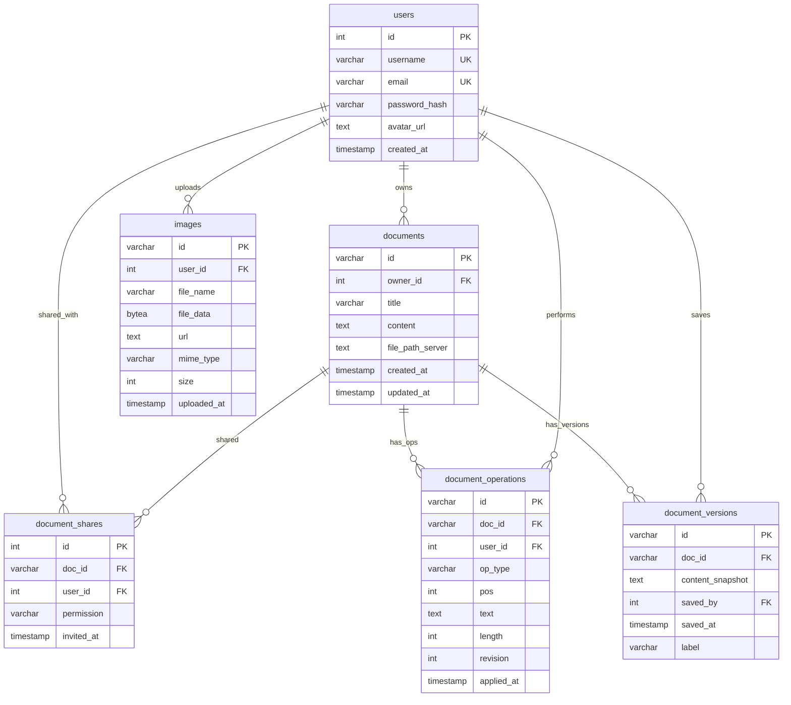
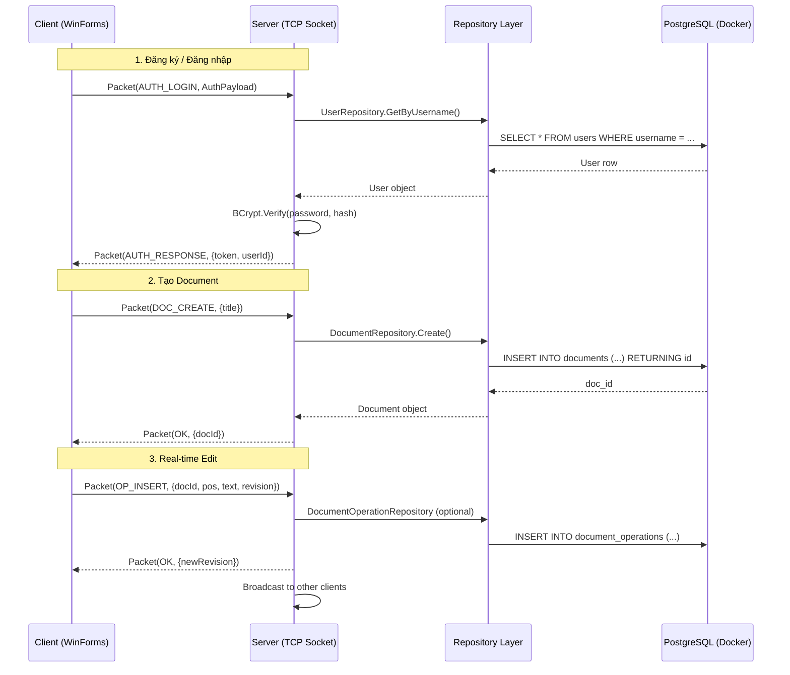

# Kế Hoạch Xây Dựng Thư Mục `Database` — PostgreSQL (Docker) + Dapper

## Bối cảnh

Project **MarkTogether.Server** (.NET Framework 4.7.2) sử dụng **Dapper** làm micro-ORM. Database PostgreSQL đã được triển khai bên ngoài bằng Docker. Bản kế hoạch này mô tả chi tiết toàn bộ cấu trúc thư mục `Database/`, các file cần tạo, nội dung từng file, và cách chúng liên kết với nhau.

> [!NOTE]
> Kế hoạch này đã điều chỉnh từ kế hoạch cũ (SQL Server mặc định) sang **PostgreSQL** theo yêu cầu. Chúng ta sẽ cần cài thêm NuGet package `Npgsql` để kết nối PostgreSQL từ C#.

---

## Cấu Trúc Cây Thư Mục Hoàn Chỉnh

```
MarkTogether.Server/
├── Database/
│   ├── Scripts/
│   │   └── schema_init.sql              ← Script SQL tạo toàn bộ bảng PostgreSQL
│   │
│   ├── DbConnectionFactory.cs           ← Factory tạo NpgsqlConnection
│   │
│   ├── Models/                          ← POCO classes đại diện cho các bảng
│   │   ├── User.cs
│   │   ├── Document.cs
│   │   ├── DocumentShare.cs
│   │   ├── DocumentOperation.cs
│   │   ├── DocumentVersion.cs
│   │   ├── Image.cs
│   │   └── ActiveSession.cs             ← (Optional) Quản lý session đang online
│   │
│   └── Repositories/                    ← Data Access Layer (SQL queries qua Dapper)
│       ├── UserRepository.cs
│       ├── DocumentRepository.cs
│       ├── DocumentShareRepository.cs
│       └── DocumentVersionRepository.cs
│
├── App.config                           ← [MODIFY] Thêm ConnectionString PostgreSQL
├── packages.config                      ← [MODIFY] Thêm Npgsql package
└── Server.csproj                        ← [MODIFY] Thêm reference Npgsql + include file mới
```

**Tổng cộng: 13 file mới + 3 file cần sửa**

---

## User Review Required

> [!IMPORTANT]
> **Cần xác nhận trước khi triển khai:**
> 1. **Connection String PostgreSQL Docker** của bạn — Tạm thời tôi sẽ dùng mẫu:
>    ```
>    Host=localhost;Port=5432;Database=marktogether;Username=postgres;Password=postgres
>    ```
>    Nếu bạn dùng port hoặc credentials khác, hãy cung cấp để tôi điều chỉnh.
>
> 2. **DocumentOperations** — Lưu từng thao tác gõ chữ (OT) trực tiếp vào PostgreSQL có thể gây nghẽn hiệu năng khi nhiều người cùng edit. Bạn có muốn:
>    - **(A)** Lưu trực tiếp vào PostgreSQL (đơn giản nhưng có thể chậm) ← **mặc định**
>    - **(B)** Dùng bộ nhớ tạm (in-memory / Redis) rồi batch insert định kỳ (phức tạp hơn nhưng nhanh hơn)
>
> 3. **Mã hóa nội dung tài liệu** — Bạn có cần mã hóa (AES) nội dung Document trước khi lưu DB không, hay chỉ mã hóa password (BCrypt) là đủ?

---

## Proposed Changes (Chi tiết từng file)

### Component 1: NuGet Package & Cấu hình

---

#### [MODIFY] [packages.config](file:///d:/hoc_tren_truong/CN/lap_trinh_mang/%C4%90%E1%BB%93%20An/NT106_Project_MarkTogether/MarkTogether.Server/packages.config)
Thêm NuGet package **Npgsql** (driver PostgreSQL cho .NET):
```xml
<package id="Npgsql" version="4.1.13" targetFramework="net472" />
```
> Dùng `Npgsql 4.x` vì tương thích tốt với .NET Framework 4.7.2. Bản 5.x+ yêu cầu .NET Standard 2.1.

#### [MODIFY] [App.config](file:///d:/hoc_tren_truong/CN/lap_trinh_mang/%C4%90%E1%BB%93%20An/NT106_Project_MarkTogether/MarkTogether.Server/App.config)
Thêm block `<connectionStrings>`:
```xml
<connectionStrings>
  <add name="MarkTogetherDb"
       connectionString="Host=localhost;Port=5432;Database=marktogether;Username=postgres;Password=postgres"
       providerName="Npgsql" />
</connectionStrings>
```

#### [MODIFY] [Server.csproj](file:///d:/hoc_tren_truong/CN/lap_trinh_mang/%C4%90%E1%BB%93%20An/NT106_Project_MarkTogether/MarkTogether.Server/Server.csproj)
- Thêm reference tới `Npgsql.dll`
- Thêm `<Compile Include="...">` cho tất cả file `.cs` mới trong `Database/`
- Thêm `<None Include="Database\Scripts\schema_init.sql" />` để include script SQL

---

### Component 2: Database Schema (PostgreSQL)

---

#### [NEW] `Database/Scripts/schema_init.sql`

Script SQL chạy trực tiếp trên PostgreSQL (pgAdmin / psql / DBeaver) để tạo toàn bộ schema:

```sql
-- =============================================
-- MarkTogether Database Schema — PostgreSQL
-- =============================================

-- 1. Bảng Users
CREATE TABLE IF NOT EXISTS users (
    id              SERIAL PRIMARY KEY,
    username        VARCHAR(50) NOT NULL UNIQUE,
    email           VARCHAR(100) UNIQUE,
    password_hash   VARCHAR(255) NOT NULL,
    avatar_url      TEXT,
    created_at      TIMESTAMP WITH TIME ZONE DEFAULT NOW()
);

-- 2. Bảng Documents
CREATE TABLE IF NOT EXISTS documents (
    id              VARCHAR(50) PRIMARY KEY DEFAULT 'doc_' || gen_random_uuid()::text,
    owner_id        INT NOT NULL REFERENCES users(id) ON DELETE CASCADE,
    title           VARCHAR(500) NOT NULL DEFAULT 'Tài liệu không tiêu đề',
    content         TEXT DEFAULT '',
    file_path_server TEXT,
    created_at      TIMESTAMP WITH TIME ZONE DEFAULT NOW(),
    updated_at      TIMESTAMP WITH TIME ZONE DEFAULT NOW()
);

-- 3. Bảng Document Shares (quan hệ N-N giữa users và documents)
CREATE TABLE IF NOT EXISTS document_shares (
    id              SERIAL PRIMARY KEY,
    doc_id          VARCHAR(50) NOT NULL REFERENCES documents(id) ON DELETE CASCADE,
    user_id         INT NOT NULL REFERENCES users(id) ON DELETE CASCADE,
    permission      VARCHAR(20) NOT NULL DEFAULT 'viewer'
                    CHECK (permission IN ('owner', 'editor', 'viewer')),
    invited_at      TIMESTAMP WITH TIME ZONE DEFAULT NOW(),
    UNIQUE(doc_id, user_id)
);

-- 4. Bảng Document Operations (OT — Operational Transformation)
CREATE TABLE IF NOT EXISTS document_operations (
    id              VARCHAR(50) PRIMARY KEY DEFAULT 'op_' || gen_random_uuid()::text,
    doc_id          VARCHAR(50) NOT NULL REFERENCES documents(id) ON DELETE CASCADE,
    user_id         INT NOT NULL REFERENCES users(id),
    op_type         VARCHAR(20) NOT NULL CHECK (op_type IN ('insert', 'delete')),
    pos             INT NOT NULL,
    text            TEXT,
    length          INT,
    revision        INT NOT NULL,
    applied_at      TIMESTAMP WITH TIME ZONE DEFAULT NOW()
);

-- Index cho việc query operations theo revision
CREATE INDEX IF NOT EXISTS idx_doc_ops_revision
    ON document_operations(doc_id, revision);

-- 5. Bảng Document Versions (snapshot lịch sử)
CREATE TABLE IF NOT EXISTS document_versions (
    id              VARCHAR(50) PRIMARY KEY DEFAULT 'ver_' || gen_random_uuid()::text,
    doc_id          VARCHAR(50) NOT NULL REFERENCES documents(id) ON DELETE CASCADE,
    content_snapshot TEXT NOT NULL,
    saved_by        INT NOT NULL REFERENCES users(id),
    saved_at        TIMESTAMP WITH TIME ZONE DEFAULT NOW(),
    label           VARCHAR(200)
);

-- 6. Bảng Images (ảnh đính kèm tài liệu)
CREATE TABLE IF NOT EXISTS images (
    id              VARCHAR(50) PRIMARY KEY DEFAULT 'img_' || gen_random_uuid()::text,
    user_id         INT NOT NULL REFERENCES users(id) ON DELETE CASCADE,
    file_name       VARCHAR(255) NOT NULL,
    file_data       BYTEA,                 -- Lưu binary trực tiếp
    url             TEXT,                   -- Hoặc đường dẫn file trên server
    mime_type       VARCHAR(50) DEFAULT 'image/png',
    size            INT,
    uploaded_at     TIMESTAMP WITH TIME ZONE DEFAULT NOW()
);
```

**Sơ đồ quan hệ (ERD):**



---

### Component 3: Connection Factory

---

#### [NEW] `Database/DbConnectionFactory.cs`

```csharp
using System.Configuration;
using System.Data;
using Npgsql;

namespace MarkTogether.Server.Database
{
    /// <summary>
    /// Factory tạo kết nối tới PostgreSQL.
    /// Connection string được đọc từ App.config.
    /// </summary>
    public static class DbConnectionFactory
    {
        private static readonly string _connectionString =
            ConfigurationManager.ConnectionStrings["MarkTogetherDb"]?.ConnectionString
            ?? "Host=localhost;Port=5432;Database=marktogether;Username=postgres;Password=postgres";

        /// <summary>
        /// Tạo và trả về một NpgsqlConnection mới (chưa Open).
        /// Người gọi có trách nhiệm gọi Open() và Dispose().
        /// </summary>
        public static IDbConnection CreateConnection()
        {
            return new NpgsqlConnection(_connectionString);
        }
    }
}
```

**Cách sử dụng:**
```csharp
using (var db = DbConnectionFactory.CreateConnection())
{
    db.Open();
    var users = db.Query<User>("SELECT * FROM users");
}
```

---

### Component 4: Models (POCOs)

---

Tất cả Model đặt trong namespace `MarkTogether.Server.Database.Models`. Property name sẽ dùng **PascalCase** trong C# và Dapper sẽ tự map sang **snake_case** của PostgreSQL (cần bật `Dapper.DefaultTypeMap.MatchNamesWithUnderscores = true`).

#### [NEW] `Database/Models/User.cs`
```csharp
public class User
{
    public int Id { get; set; }
    public string Username { get; set; }
    public string Email { get; set; }
    public string PasswordHash { get; set; }
    public string AvatarUrl { get; set; }
    public DateTime CreatedAt { get; set; }
}
```

#### [NEW] `Database/Models/Document.cs`
```csharp
public class Document
{
    public string Id { get; set; }
    public int OwnerId { get; set; }
    public string Title { get; set; }
    public string Content { get; set; }
    public string FilePathServer { get; set; }
    public DateTime CreatedAt { get; set; }
    public DateTime UpdatedAt { get; set; }
}
```

#### [NEW] `Database/Models/DocumentShare.cs`
```csharp
public class DocumentShare
{
    public int Id { get; set; }
    public string DocId { get; set; }
    public int UserId { get; set; }
    public string Permission { get; set; }  // "owner", "editor", "viewer"
    public DateTime InvitedAt { get; set; }
}
```

#### [NEW] `Database/Models/DocumentOperation.cs`
```csharp
public class DocumentOperation
{
    public string Id { get; set; }
    public string DocId { get; set; }
    public int UserId { get; set; }
    public string OpType { get; set; }      // "insert" hoặc "delete"
    public int Pos { get; set; }
    public string Text { get; set; }        // Nội dung chèn (cho insert)
    public int? Length { get; set; }         // Số ký tự xóa (cho delete)
    public int Revision { get; set; }
    public DateTime AppliedAt { get; set; }
}
```

#### [NEW] `Database/Models/DocumentVersion.cs`
```csharp
public class DocumentVersion
{
    public string Id { get; set; }
    public string DocId { get; set; }
    public string ContentSnapshot { get; set; }
    public int SavedBy { get; set; }
    public DateTime SavedAt { get; set; }
    public string Label { get; set; }
}
```

#### [NEW] `Database/Models/Image.cs`
```csharp
public class Image
{
    public string Id { get; set; }
    public int UserId { get; set; }
    public string FileName { get; set; }
    public byte[] FileData { get; set; }    // Binary data ảnh
    public string Url { get; set; }
    public string MimeType { get; set; }
    public int? Size { get; set; }
    public DateTime UploadedAt { get; set; }
}
```

#### [NEW] `Database/Models/ActiveSession.cs` *(Optional)*
```csharp
/// <summary>
/// Model quản lý user đang online trong document (không lưu DB, dùng in-memory).
/// </summary>
public class ActiveSession
{
    public int UserId { get; set; }
    public string Username { get; set; }
    public string DocId { get; set; }
    public int CursorPosition { get; set; }
    public DateTime ConnectedAt { get; set; }
}
```

---

### Component 5: Repositories (Data Access Layer)

---

Mỗi Repository là một **static class** chứa các hàm truy vấn Dapper. Tất cả hàm đều sử dụng `DbConnectionFactory.CreateConnection()`.

#### [NEW] `Database/Repositories/UserRepository.cs`

| Hàm | Mô tả | SQL |
|-----|--------|-----|
| `GetByUsername(string username)` | Tìm user theo username (đăng nhập) | `SELECT * FROM users WHERE username = @Username` |
| `GetByEmail(string email)` | Tìm user theo email | `SELECT * FROM users WHERE email = @Email` |
| `GetById(int id)` | Lấy thông tin user theo ID | `SELECT * FROM users WHERE id = @Id` |
| `Create(User user)` | Tạo user mới, trả về ID | `INSERT INTO users (...) VALUES (...) RETURNING id` |
| `Update(User user)` | Cập nhật username, avatar | `UPDATE users SET username=@Username, avatar_url=@AvatarUrl WHERE id=@Id` |
| `UpdatePassword(int id, string hash)` | Đổi mật khẩu | `UPDATE users SET password_hash=@Hash WHERE id=@Id` |
| `Search(string query, int limit)` | Tìm user (chia sẻ tài liệu) | `SELECT ... WHERE username ILIKE @Query OR email ILIKE @Query LIMIT @Limit` |

**Lưu ý:** Password sẽ được hash bằng **BCrypt.Net-Next** (đã cài sẵn) **trước** khi gọi `Create()`. Không bao giờ lưu plain text.

---

#### [NEW] `Database/Repositories/DocumentRepository.cs`

| Hàm | Mô tả |
|-----|--------|
| `Create(Document doc)` | Tạo document mới, trả về ID |
| `GetById(string docId)` | Lấy chi tiết document |
| `GetByUserId(int userId, int page, int limit)` | Danh sách document của user (bao gồm cả document được share) |
| `UpdateTitle(string docId, string title)` | Đổi tên document |
| `UpdateContent(string docId, string content)` | Cập nhật nội dung |
| `Delete(string docId)` | Xóa document (cascade xóa shares, versions, operations) |
| `GetCurrentRevision(string docId)` | Lấy revision hiện tại = `MAX(revision)` từ `document_operations` |

---

#### [NEW] `Database/Repositories/DocumentShareRepository.cs`

| Hàm | Mô tả |
|-----|--------|
| `ShareDocument(string docId, int userId, string permission)` | Thêm quyền truy cập |
| `UpdatePermission(string docId, int userId, string permission)` | Sửa quyền |
| `RevokeAccess(string docId, int userId)` | Thu hồi quyền |
| `GetCollaborators(string docId)` | Danh sách người cộng tác (JOIN với `users`) |
| `GetPermission(string docId, int userId)` | Kiểm tra quyền của user với document |

---

#### [NEW] `Database/Repositories/DocumentVersionRepository.cs`

| Hàm | Mô tả |
|-----|--------|
| `SaveVersion(DocumentVersion ver)` | Lưu snapshot nội dung hiện tại |
| `GetVersions(string docId, int page, int limit)` | Danh sách versions (JOIN `users` để lấy tên người lưu) |
| `GetVersionDetail(string versionId)` | Chi tiết version (bao gồm `content_snapshot`) |
| `DeleteVersion(string versionId)` | Xóa version |
| `RestoreVersion(string docId, string versionId)` | Khôi phục → Copy `content_snapshot` vào `documents.content` |

---

## Luồng Hoạt Động (Data Flow)



---

## Open Questions

> [!WARNING]
> **Câu hỏi cần trả lời trước khi bắt đầu code:**

1. **Connection String Docker PostgreSQL** — Bạn dùng port nào, username/password gì?
   - Mặc định tôi sẽ dùng: `Host=localhost;Port=5432;Database=marktogether;Username=postgres;Password=postgres`

2. **DocumentOperations** — Bạn chọn phương án nào?
   - **(A)** Lưu trực tiếp vào PostgreSQL *(đơn giản, phù hợp MVP)*
   - **(B)** Dùng in-memory buffer rồi batch insert *(phức tạp hơn)*

3. **Image Storage** — Lưu ảnh dạng `BYTEA` (binary trong DB) hay lưu file trên disk rồi chỉ lưu đường dẫn `url` vào DB?

4. **Bảng `ActiveSession`** — Bạn có muốn lưu session online vào DB không, hay chỉ quản lý in-memory trên Server là đủ?

---

## Verification Plan

### Bước 1: Cài đặt NuGet
```bash
# Trong Package Manager Console (Visual Studio)
Install-Package Npgsql -Version 4.1.13
```

### Bước 2: Chạy schema_init.sql
```bash
# Kết nối tới PostgreSQL Docker
psql -h localhost -p 5432 -U postgres -d marktogether -f schema_init.sql
```

### Bước 3: Test kết nối trong Program.cs
```csharp
static void Main(string[] args)
{
    // Bật mapping snake_case → PascalCase cho Dapper
    Dapper.DefaultTypeMap.MatchNamesWithUnderscores = true;

    using (var db = DbConnectionFactory.CreateConnection())
    {
        db.Open();
        Console.WriteLine("✓ Kết nối PostgreSQL thành công!");

        // Test: Tạo user
        var hash = BCrypt.Net.BCrypt.HashPassword("test123");
        var id = UserRepository.Create(new User
        {
            Username = "test_user",
            Email = "test@mail.com",
            PasswordHash = hash
        });
        Console.WriteLine($"✓ Tạo user thành công, ID = {id}");

        // Test: Đọc lại user
        var user = UserRepository.GetById(id);
        Console.WriteLine($"✓ Đọc user: {user.Username}, Hash khớp: {BCrypt.Net.BCrypt.Verify("test123", user.PasswordHash)}");
    }
}
```

### Bước 4: Kiểm tra dữ liệu trên PostgreSQL
```sql
SELECT * FROM users;
SELECT * FROM documents;
```
